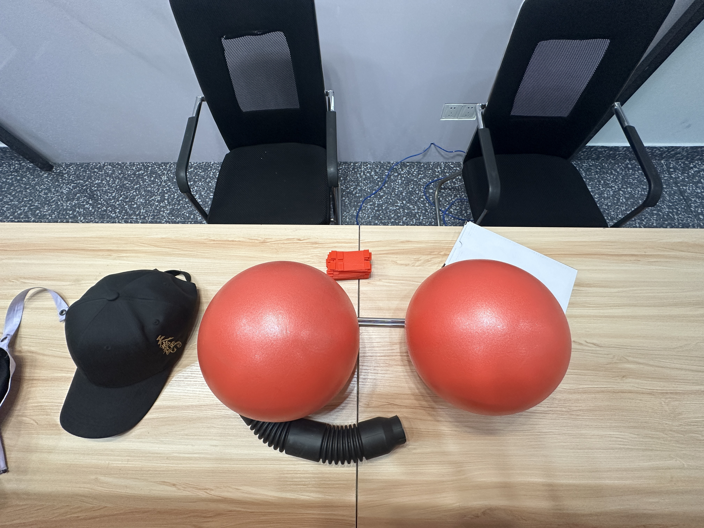
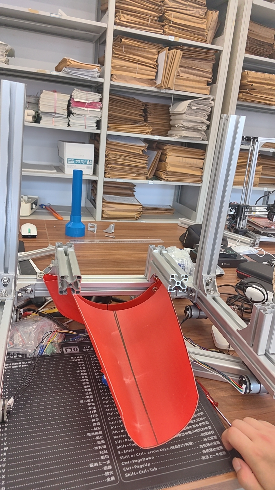
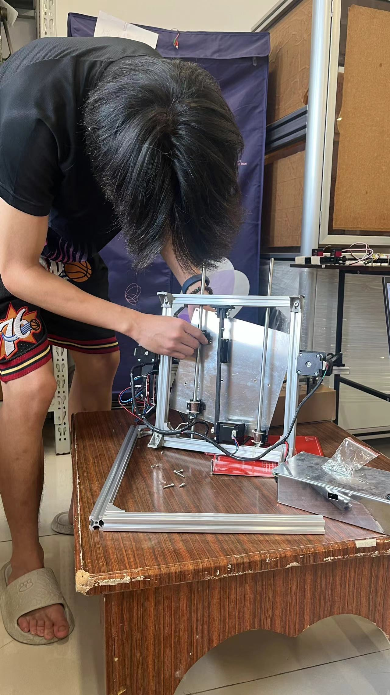
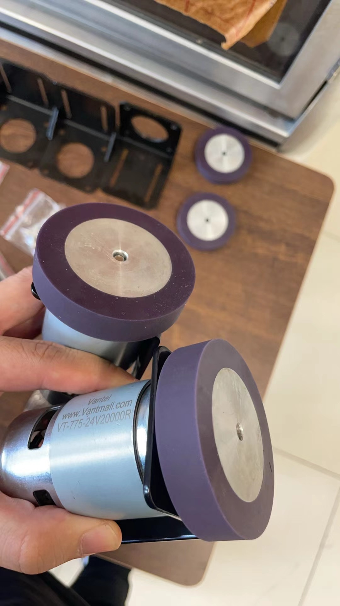
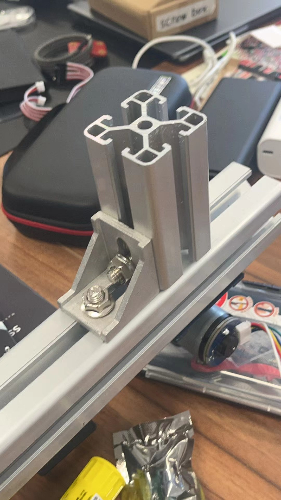
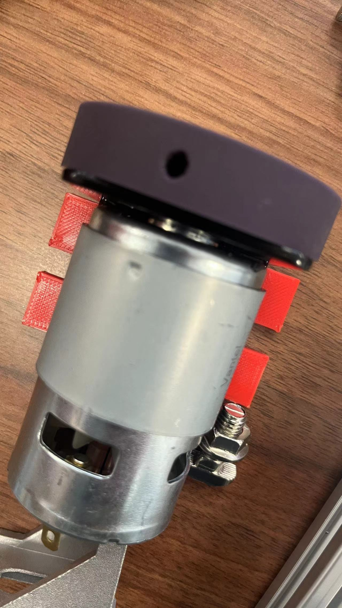
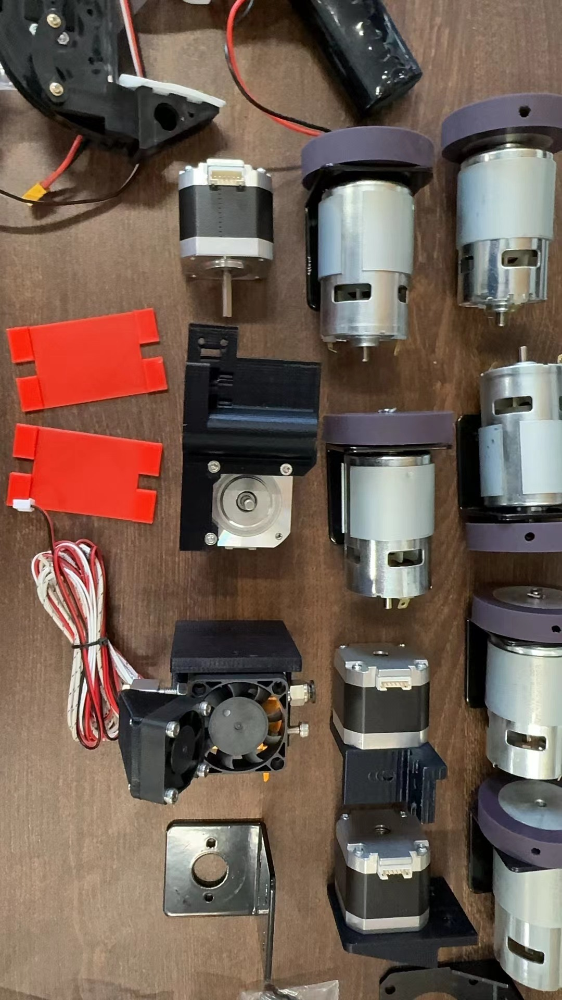
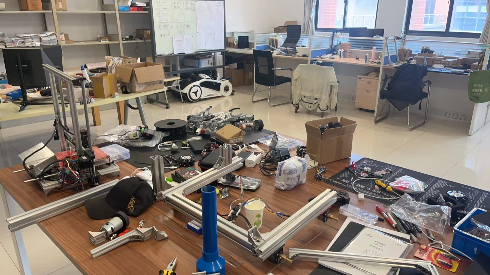
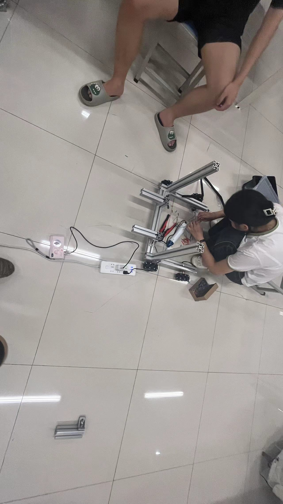
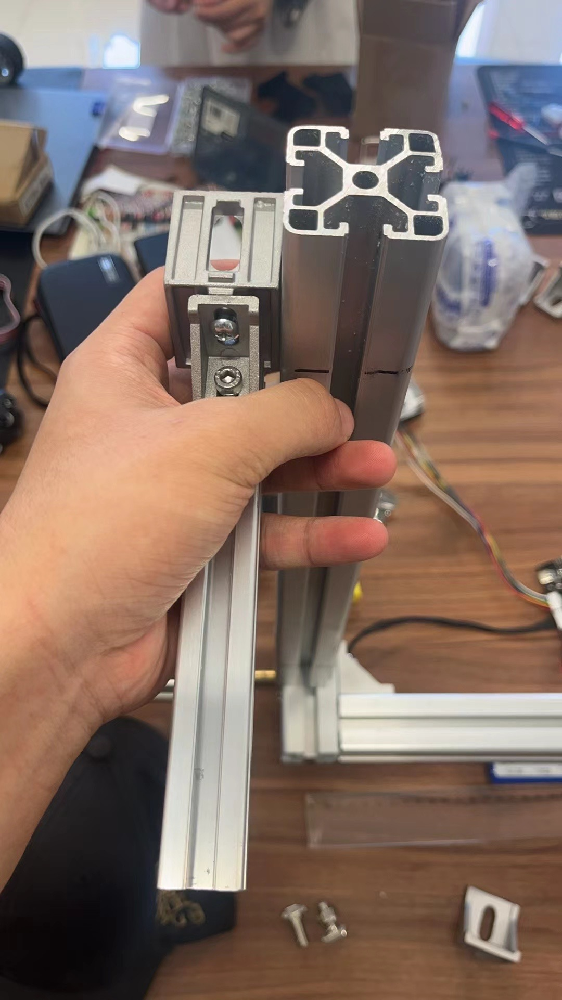

# 小组任务 完成高转电机与上位机通讯
## 成员名单
#### 电控组
@SaNgZi @杨鑫海 

# 目前现阶段的方案有

## @杨鑫海 与esp32交互环境安装指南 https://docs.espressif.com/projects/arduino-esp32/en/latest/inst3f46f20761a11ca51703d597acb773e.JPG)alling.html

## 1. ROS开发板方案 X esp8266

## 2. esp32 X Pi5

   
   
# 高转电机
Arduino 控制

## 参考资料
- esp_32_环境部署指南 https://docs.espressif.com/projects/arduino-esp32/en/latest/getting_started.html

- esp_Github文档 https://github.com/espressif/arduino-esp32?tab=readme-ov-file#supported-chips

- esp论坛支持 https://esp32.com/viewforum.php?f=12

