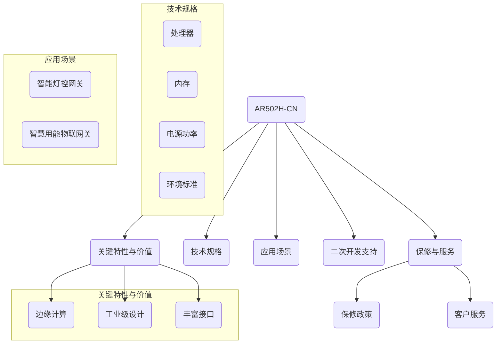

<!-- Improved compatibility of back to top link: See: https://github.com/othneildrew/Best-README-Template/pull/73 -->

<!--
*** Thanks for checking out the new_energy_coder_club. If you have a suggestion
*** that would make this better, please fork the repo and create a pull request
*** or simply open an issue with the tag "enhancement".
*** Don't forget to give the project a star!
*** Thanks again! Now go create something AMAZING! :D
***
-->

<!-- PROJECT SHIELDS -->
<!--
*** I'm using markdown "reference style" links for readability.
*** Reference links are enclosed in brackets [ ] instead of parentheses ( ).
*** See the bottom of this document for the declaration of the reference variables
*** for contributors-url, forks-url, etc. This is an optional, concise syntax you may use.
*** https://www.markdownguide.org/basic-syntax/#reference-style-links
-->

<!-- PROJECT LOGO -->
 

  

  <h3 align="center">new_energy_coder_club</h3>

  
         

#### 我们的项目PPT
- https://low-power-inspection-veh-95gmidb.gamma.site/
- 

#### 赛题链接
- 在线链接：[https://iot.sjtu.edu.cn/show.aspx?info_lb=34&info_id=3962&flag=2](https://iot.sjtu.edu.cn/show.aspx?info_lb=34&info_id=3962&flag=2)
- 命题选择：华为数通（数据网关）作为“端-边-云”架构计算的结合点，应用于智能工厂巡检系统。

#### 资料共享
- [AR502H-CN文档](https://support.huawei.com/enterprise/zh/routers/ar500-pid-21247181)：华为AR502H-CN路由器的详细文档。
- [华为命题资料](https://iot.sjtu.edu.cn/ueditor/net/upload/file/20240327/6384717615388308323667272.pdf)：包含嵌入式、服务器、产品等相关信息。
- [其他文档](https://bbs.huaweicloud.com/forum/thread-0296147346866118020-1-1.html)：其他与项目相关的文档链接。

#### 团队构成
- **指导老师**：
  - 孙潇楠（负责小车部分）
  - 于敏昌（负责网关部分）
- **数据网关组长**：[@顾舒腾](mailto:%E9%A1%BE%E8%88%92%E8%85%BE)
- **小车核心成员**：
  - 朱佩韦（负责上位机与组织工作）
  - 闻志伟（负责下位机工作）

#### 项目进度
- **顾舒腾**：5月25日，配置了M2环境（Mac-mini）的pip和python路径。

#### 成员进度
- **崔正阳**：5月26日，根据参考手册上电AR502H-CN，但console口无法识别，计划通过U盘启动解决。
- **朱佩韦**：5月26日，上传了所有培训视频到qq群，并分享了U盘开局文件的制作方法。
- **许子涵**：5月26日，更新了项目readme文件，并了解项目进程。

---
There are many great README templates available on GitHub; however, I didn't find one that really suited my needs so I created this enhanced one. I want to create a README template so amazing that it'll be the last one you ever need -- I think this is it.

Here's why:
* Your time should be focused on creating something amazing. A project that solves a problem and helps others
* You shouldn't be doing the same tasks over and over like creating a README from scratch
* You should implement DRY principles to the rest of your life :smile:

Of course, no one template will serve all projects since your needs may be different. So I'll be adding more in the near future. You may also suggest changes by forking this repo and creating a pull request or opening an issue. Thanks to all the people have contributed to expanding this template!

Use the `BLANK_README.md` to get started.

(<a href="#readme-top">back to top</a>)

### Built With 技术层

This section should list any major frameworks/libraries used to bootstrap your project. Leave any add-ons/plugins for the acknowledgements section. Here are a few examples.

* [![Next][Next.js]][Next-url]
* [![React][React.js]][React-url]
* [![Vue][Vue.js]][Vue-url]
* [![Angular][Angular.io]][Angular-url]
* [![Svelte][Svelte.dev]][Svelte-url]
* [![Laravel][Laravel.com]][Laravel-url]
* [![Bootstrap][Bootstrap.com]][Bootstrap-url]
* [![JQuery][JQuery.com]][JQuery-url]

(<a href="#readme-top">back to top</a>)

#### AR502H-CN路由器概述（基于提供的Mermaid图表）

**注意**：以上概述基于提供的Mermaid图表和文档信息。实际应用场景和技术规格可能根据具体项目需求有所不同。
## 个人进度
### 朱佩韦
- 6.9 维护仓库标准化

### 许子涵
- 6.8 更新两个仓库的readme进行相应的整理

### 崔正阳
- 6.8 @NANA 首次登陆配置；
登录名:admin  密码：Sad123456
   huawei登录名：AR502H-CN  密码：Sad123456

## 【维护记录】：
#### 5.22 @许子涵涵 Readme
#### 5.25 @DarrenPig Readme 报名进度
#### 5.26 @NANA 更新 readme 和个人进度
#### 6.6  @许子涵涵 更新 readme 和 Mermaid
#### 6.8  @NANA 更新 readme和环境配置进度
#### 6.9  @DarrenPig 更新整理Readme
#### 6.14 @许子涵涵 提交作品创意表
#### 7.25 已上交作品完整设计方案和实物演示视频

