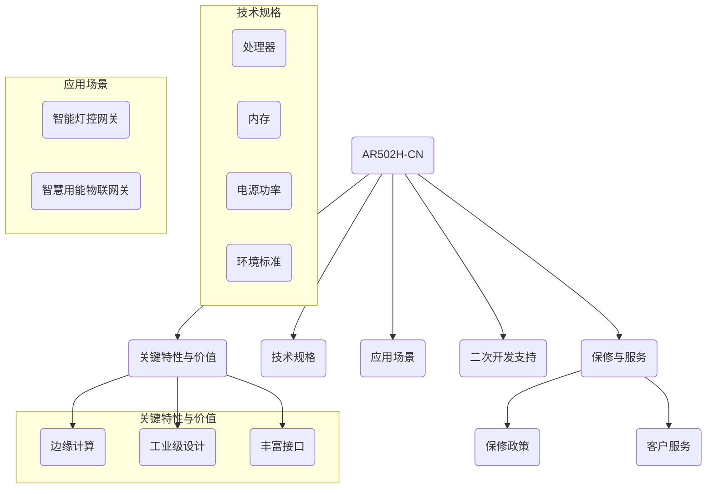

### 华为数通（数据网关）与智能工厂巡检系统
         

#### 赛题链接
- 在线链接：[https://iot.sjtu.edu.cn/show.aspx?info_lb=34&info_id=3962&flag=2](https://iot.sjtu.edu.cn/show.aspx?info_lb=34&info_id=3962&flag=2)
- 命题选择：华为数通（数据网关）作为“端-边-云”架构计算的结合点，应用于智能工厂巡检系统。

#### 资料共享
- [AR502H-CN文档](https://support.huawei.com/enterprise/zh/routers/ar500-pid-21247181)：华为AR502H-CN路由器的详细文档。
- [华为命题资料](https://iot.sjtu.edu.cn/ueditor/net/upload/file/20240327/6384717615388308323667272.pdf)：包含嵌入式、服务器、产品等相关信息。
- [其他文档](https://bbs.huaweicloud.com/forum/thread-0296147346866118020-1-1.html)：其他与项目相关的文档链接。

#### 团队构成
- **指导老师**：
  - 孙潇楠（负责小车部分）
  - 于敏昌（负责网关部分）
- **数据网关组长**：[@顾舒腾](mailto:%E9%A1%BE%E8%88%92%E8%85%BE)
- **小车核心成员**：
  - 朱佩韦（负责上位机与组织工作）
  - 闻志伟（负责下位机工作）

#### 项目进度
- **顾舒腾**：5月25日，配置了M2环境（Mac-mini）的pip和python路径。

#### 成员进度
- **崔正阳**：5月26日，根据参考手册上电AR502H-CN，但console口无法识别，计划通过U盘启动解决。
- **朱佩韦**：5月26日，上传了所有培训视频到qq群，并分享了U盘开局文件的制作方法。
- **许子涵**：5月26日，更新了项目readme文件，并了解项目进程。

#### AR502H-CN路由器概述（基于提供的Mermaid图表）

**注意**：以上概述基于提供的Mermaid图表和文档信息。实际应用场景和技术规格可能根据具体项目需求有所不同。
## 个人进度
### 朱佩韦
- 6.9 维护仓库标准化

### 许子涵
- 6.8 更新两个仓库的readme进行相应的整理

### 崔正阳
- 6.8 @NANA 首次登陆配置；
登录名:admin  密码：Sad123456
   huawei登录名：AR502H-CN  密码：Sad123456

## 【维护记录】：
#### 5.22 @许子涵涵 Readme
#### 5.25 @DarrenPig Readme 报名进度
#### 5.26 @NANA 更新 readme 和个人进度
#### 6.6  @许子涵涵 更新 readme 和 Mermaid
#### 6.8  @NANA 更新 readme和环境配置进度
#### 6.9  @DarrenPig 更新整理Readme
#### 6.14 @许子涵涵 提交作品创意表