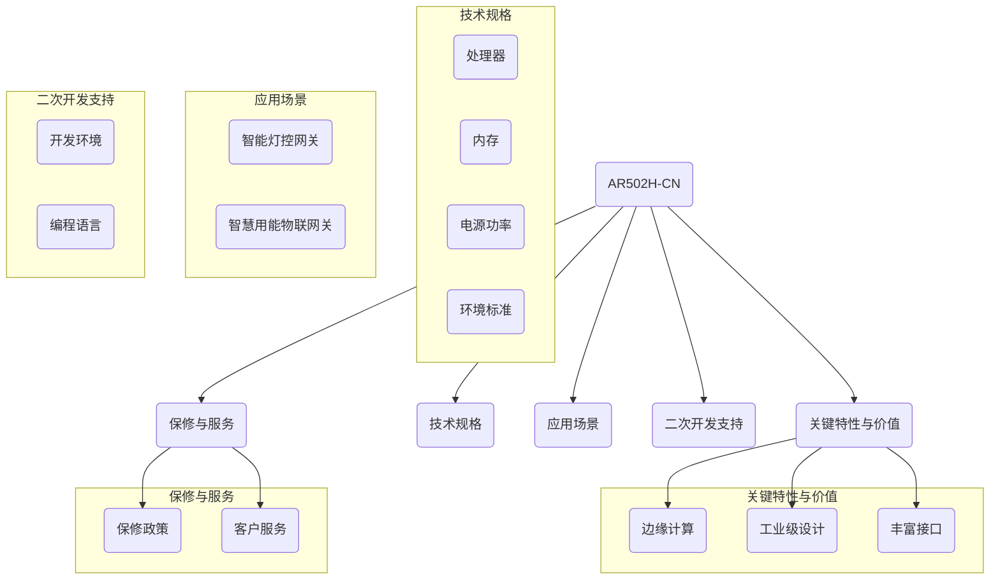

##### https://iot.sjtu.edu.cn/show.aspx?info_lb=34&info_id=3962&flag=2

## 赛题在线链接：我们选择命题三：华为数通（数据网关）做我们的“端-边-云”架构计算————结合智能工厂巡检系统

## 【资料共享】：
- 【AR502H-CN文档】：https://support.huawei.com/enterprise/zh/routers/ar500-pid-21247181
- 【嵌入式、服务器、产品】华为命题 https://iot.sjtu.edu.cn/ueditor/net/upload/file/20240327/6384717615388308323667272.pdf
- 【文档】：https://bbs.huaweicloud.com/forum/thread-0296147346866118020-1-1.html
- 【。。。】

## 指导老师（光电/电气）：孙潇楠(小车)、于敏昌（网关）
数据网关组长：@顾舒腾
-- 

- 小车核心成员：
朱佩韦（上位机、组织）、闻志伟（下位机）
[ 指导老师：孙潇楠]
---
## 小组队长（技术支撑）：@顾舒腾

## 【项目进度】：
### 顾舒腾
- 5.25 @顾舒腾 配置进度：M2 环境（Mac-mini）配置部署 M2 的 pip \ python 路径

## 【成员进度}：

### 崔正阳
- 5.26 @N 根据参考手册，上电AR502H-CN，console口无法识别，准备通过U盘启动解决
### 朱佩韦
- 5.26 @DarrenPig 上传所有培训视频到qq群，U盘开局文件的制作方法： https://support.huawei.com/hedex/hdx.do?docid=EDOC1100247454&id=ZH-CN_TOPIC_0000001121575890
### 许子涵
- 5.26 @许子涵涵 更新readme,了解项目进程......

## 【维护记录】：
#### 5.22 @许子涵涵 Readme
#### 5.25 @DarrenPig Readme 报名进度
#### 5.26 @NANA 更新 readme 和个人进度
#### 6.6  @许子涵涵 更新 readme 和 Mermaid

