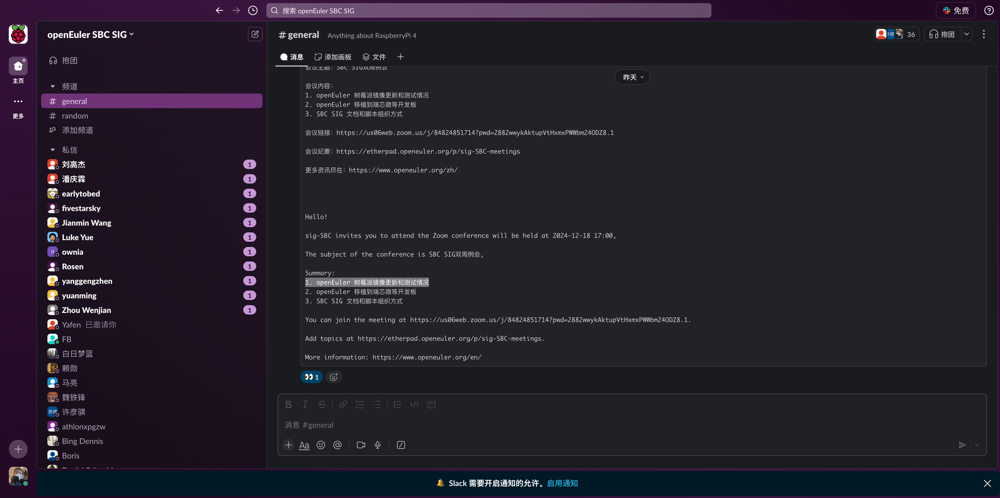

# 基于 openEuler 和 Rt-thread 对系统混合部署 验证 MICA 框架机器人运行时的篮球发球机器人设计
DarrenPig 22230635@czu.cn

# 篮球发球机器人框架结构补充与梳理

## 硬件手柄设计：做好相关的设计与选型工作

> # 星闪通信实验平台
> ## 海鸥派 连接通信
> 1.小车 2.手柄
> 1.基于WS63模组设计手柄
> 2.实现手柄控制小车(前进，后退，加速，减速，左右转，掉头，转圈等)
> ## 交付要求: 
> 1.提供源码，提供5套手柄，提供相关分析、设计(手柄设计源文件等)、开发、测试、验收等开发过程中的详细文件记录等;
> 2.整合精华篇幅内容，汇总为PPT课件，要求内容质量干练清爽。
> # 1月20号交付

## MICA框架结构
MICA框架支持管理域和实时域的部署、隔离和调度，能够实现Linux和RT-Thread的混合部署。这种架构使得篮球发球机器人可以在一个SoC上同时运行Linux和RT-Thread，其中：
- [Linux](#Linux)负责复杂的应用处理，如图像识别和路径规划。
- [RT-Thread](#RT-Thread)负责实时控制，如电机驱动和传感器数据采集。

## openEuler Embedded与RT-Thread设计
本文基于国产Linux发行版[openEuler Embedded](#openEuler-Embedded)和RTOS物联网系统[RT-Thread](#RT-Thread)进行设计。使用主控开发板[树莓派5](#树莓派5)作为上位机，底层控制电机驱动板[ESP32-S3](#ESP32-S3)，完成操作系统编译、混合部署，并完成国产架构MICA的可行性与特性验证。

## 控制方案与电机设计
控制方面目标是实现低成本完成标准场地篮球的投射，采用FRC国家主流球类控制方案。以国产亚博智能的电机作为设计编码电机，对发射装置的稳定性与可控制性做出可行性方案与简易验证。

## RT-Thread特性
RT-Thread提供高实时性和稳定性，适合处理对时间敏感的任务，如电机控制和传感器数据处理，提高系统的稳定性。通过算法控制编码电机的转速与转动逻辑，消抖以提高鲁棒性。

## OpenAMP框架与通信优化
通过[OpenAMP](#OpenAMP)框架，Linux和RT-Thread之间可以实现高效的IPC（进程间通信）和数据传输机制。结合[RedCap 5G](#RedCap-5G)通信和[星闪技术（WS63模组）](#星闪技术)对通信进行高性能优化。

## POE高压传输
使用[POE高压传输](#POE高压传输)的方式进行高效控制与透传，确保系统的稳定运行和数据的实时传输。

## 系统稳定性验证
验证一套从完成系统部署到电机控制以及通信技术在篮球发射机器人系统上的稳定性验证，确保整个系统的可靠性和有效性。

---

### Linux
Linux负责复杂的应用处理，如图像识别和路径规划。

### RT-Thread
RT-Thread负责实时控制，如电机驱动和传感器数据采集。

### openEuler Embedded
本文基于国产Linux发行版[openEuler Embedded](http://openeuler.org/)和RTOS物联网系统RT-Thread进行设计。

### 树莓派5

树莓派镜像构建指导：https://pages.openeuler.openatom.cn/embedded/docs/build/html/openEuler-22.03-LTS-SP2/bsp/arm64/raspberrypi4/build.html

使用主控开发板[树莓派5](https://www.raspberrypi.org/products/raspberry-pi-4-model-b/)作为上位机。
raspberrypi SIG 仓库：
[使用指南](https://gitee.com/openeuler/raspberrypi/blob/master/documents/%E6%A0%91%E8%8E%93%E6%B4%BE%E4%BD%BF%E7%94%A8.md#gpio

SBC(原 树莓派SIG)会议地址+Slack微型论坛
https://etherpad.openeuler.org/p/sig-SBC-meetings

https://app.slack.com/client/T0124132C20/C011R3Z6UPQ

### ESP32-S3
底层控制电机驱动板[ESP32-S3](https://www.espressif.com/en/products/socs/esp32-s3)。

### OpenAMP
通过[OpenAMP](https://www.xilinx.com/html_docs/xapp1257.htm)框架，Linux和RT-Thread之间可以实现高效的IPC（进程间通信）和数据传输机制。

### RedCap 5G
结合[RedCap 5G](https://www.3gpp.org/technologies/keywords/124-5g-redcap)通信进行高性能优化。

### 星闪技术
结合[星闪技术（WS63模组）](https://www.csdn.net/blog/qq_41757273/)对通信进行高性能优化。

### POE高压传输
使用[POE高压传输](https://www.h3c.com/solution/technical/poe/)的方式进行高效控制与透传。

## 参考文献：
- openEuler Embedded在线文档【Sphinx构建】：https://pages.openeuler.openatom.cn/embedded/docs/build/html/openEuler-22.03-LTS-SP2/index.html
- 基于openEuler Embedded树莓派使用：https://pages.openeuler.openatom.cn/embedded/docs/build/html/openEuler-22.03-LTS-SP2/bsp/arm64/raspberrypi4/build.html#openeuler-embedded

