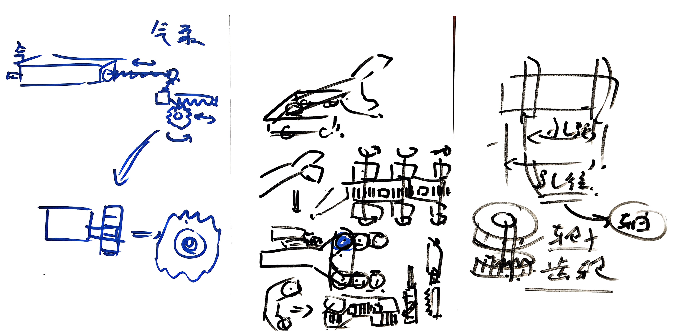

<!-- Improved compatibility of back to top link: See: https://github.com/othneildrew/Best-README-Template/pull/73 -->

<!--
*** Thanks for checking out the new_energy_coder_club. If you have a suggestion
*** that would make this better, please fork the repo and create a pull request
*** or simply open an issue with the tag "enhancement".
*** Don't forget to give the project a star!
*** Thanks again! Now go create something AMAZING! :dancer: 

<!-- PROJECT SHIELDS -->
<!--
*** I'm using markdown "reference style" links for readability.
*** Reference links are enclosed in brackets [ ] instead of parentheses ( ).
*** See the bottom of this document for the declaration of the reference variables
*** for contributors-url, forks-url, etc. This is an optional, concise syntax you may use.
*** https://www.markdownguide.org/basic-syntax/#reference-style-links
-->

<!-- PROJECT LOGO -->
 

  <h1 align="center"> 2025赛季全国机器人竞赛-ROBOCON </h1>

  
         

  

   We are a group of active material stations, undergraduate competition scientific research organizations related to new energy, robotics, and topic discussions in China.我们是一只活跃在中国的新能源、机器人、话题相关的资料小站和本科生的比赛、科研组织，希望能给您的校园生活，以可以参考的实用价值 ！
     
    <a href="https://gitee.com/darrenpig/new_energy_coder_club"><strong>Explore the docs »</strong></a>
     
     

---

# 鸣谢各位Sponsor为本次机器人大赛提供资金支持📂
###  @和尚 1000元 @徐龙飞  @22021530杨力滔 @朱意卓 

---

## @卢王淳 2025赛期管理

## @7. 2025例会主持/仓库维护

# 24队长_ @Pony17刘英淇 24项管_@卢王淳 

 

## 项目进程📑

#### 241120 完成初期团队投票，创建群聊，进行了第一次线下成员会议
#### 241213 团队不断扩大，逐步进行底盘结构、战队经费、人员安排、采购环节等一系列问题的讨论 @7. 进行主持，@DarrenPig @Pony17 明确近期成果和下阶段任务，@郑绍恺 采购环节明确
#### 250111 离校前最后一次线下组会，完成开发板寄送
#### 250113 在手一块51单片机，一块RT-THREAD的RA6M3芯片  @Pony17 
#### 250306 人形机器人底盘确定，A板和C板下单
#### 250311 接待江苏理工队长，系统展示Gitee仓库和实验室项目，江苏理工队长结合去年实战经验与今年技术进度提出创新解法，双方围绕技术互补、资源共享达成协作共识，共探赛事备战最优路径
#### 250317 416实验室线下组会，推进星闪手柄进度，采购情况汇总，讨论接下来与江理工的交流，机械组情况讨论，Gitee使用教学。冲刺接下来的RC中期检测
#### 250321 416实验室线下组会，讨论团队各组进程，汇报硬件采购情况，确定去江理工交流讨论的安排与人员，汇报软件代码运行进程
#### 250323 向机械学院老师和相关企业领导介绍了我们的产品并一同分析了发展趋势和风险，随后与机械学院彭柯尹等人详细的介绍了我们团队组成，任务与发展目标，争取机械学院的资金和人力支持、与其取得合作关系
#### 250323 赴江苏理工学院机器人团队交流，聚焦开源仓库设立，从机械、电控、上位机至运营多层面深入切磋

#### 250324  @DarrenPig  @单广志 给机械组新人们配好了软件，硬件和机械的大家伙们一起赶时间深夜拧螺丝装底座
#### 250327 416实验室线下组会，迎接新面孔，交通NEC省赛完载，节能减排七人小组应召组成
#### 250330 周末线上组会，节能减排分支准备完赛，灵巧手方案调研，机械组发球机构讨论优化，与泰翔科技合作项目汇报，各组长进行进度汇报。
#### 250402 416实验室线下组会，就硬件问题开展讨论会，中期检测机械迎接4.10阶段性考核
#### 250406 进度大会，明确各组方向，分出供电负责人 @牛良旭 ，手柄负责人@崔正阳，电焊 @杨鑫海 ，运球实现
#### 250407 赶工中， @DarrenPig 安排详细计划，分工明确。
#### 250409 通宵赶工，完善小车结构，基本实现移动和发球功能。安排运营小组进行10号中期检测材料收集汇总，视频剪辑，准备材料提交。
#### 250410 中期检测材料提交完毕。
#### 250412-13 朱佩韦带队前往浙江杭州，参加了于萧山万怡酒店召开的openEuler Developer Day2025，期间拜访参观了浙江理工大学的团队，收获颇丰
#### 250429 416线下组会进行项目进度的汇报， @单广志 提出实验室需要保持卫生整洁，物品使用后及时归位。同时提议大家在五一期间进行复习。
#### 250430 RC中期检测顺利通过！ @单广志  @Pony17 根据贡献点进行RC人员优化。 @DarrenPig 对各小组进行学习任务分配。
#### 250511 A416线下会议，人员区分优化 @Pony17 ，R1进度汇报 @彭柯尹  @郑钦文 ，R2介绍、苏州飞控项目合作介绍、项目推进思路，争取21日前完成R2机器人模型实物 @DarrenPig ，机械院会议陈述 @崔正阳
## 各组长进度🏃‍♂️‍➡️：
---
### @DarrenPig EGligong
#### 1.29 ✅ubuntu 的镜像[ubuntu-22.04.3-desktop-amd64] VMware 安装, shell环境学习
#### 1.30 ✅啃 yocto 的文档，本地部署~/.bashrc-Linux环境变量（Day 1）
#### 1.31 ✅bitbake、vim、poky（Day 2）
#### 2.1 ✅Yocto部署笔记、sig组会（Day 3）
#### 2.3 ✅code、❌SSH到Ubuntu环境
#### 2.4 ✅报名表、Yocto文档到构建
#### 250114 ✅机械组会，介绍MayCad ，Fusion 360 的基础学习资源，和团队已有的数字资产
#### 250302 拜访南理工RC实验室，与队员交流手柄方案、分享设计，对接电控组长探讨开源、文化与经费
---
###  @单广志 
#### 250116 ✅电控组issue上传资料链接
#### 250117 开始搓手柄，淘了一套烙铁头
#### 250118 拓展板项目进行
#### 250210 拓展版基本完成STM32的开发，pi5开始进行
#### 250215 部署灵犀x1环境
#### 250221 星闪手柄进度继续
#### 202503前期 完成气动选型方案，中期检测后进行调试驱动，以及备选方案搓轮发射结构的设计
#### 202503后期 环境部署基本结束🔚，星闪手柄重新备bom，以及跑动江理工讨论进度，ros板以及ESP32底盘驱动可行
#### 202504前期 例会➕组会不停，带领成员完成中期检测材料。
#### 202504后期 上位机主控树莓派，海鸥派上手调试，旨在5月前期完成星闪透传。
---
###  @Pony17 
#### 250117 HMI环境配置完毕
---
###    @郑绍恺 
#### 250118 ✅esp32控制板学习
#### 250120 ✅环境arduino使用学习
#### 250212 ✅了解电路的基本原理
#### 250213 ✅整理关节电机信息
---
###  @NANA 
#### 250121 cubeide编辑引脚运行报错后续软件启动发生错误，重新下载软件解压持续报错。尝试使用CUBEMX代替
---
###  @卢王淳 
#### 250306 ✅PPT基础操作学习
#### 250321 ✅ubuntu的镜像 Vmware 安装   
#### 250327 EDA基础学习  
#### 250430 25RC仓库更新
#### 250511 PlatformIO环境配置
#### 250514 R1进度跟进
---
###  @彭柯尹 
#### 250323 江理工交流机械会议
#### 250328完成铝方切割，和机械组部署
#### 250331部署组员完成基本的零件设计
#### 250401装配，完成初稿
#### 250504根据图纸，和组员理清气缸搓轮齿轮方案，并部署下一阶段任务
#### 250506安装仿真软件，推进机械上位机共研工作
#### 250508底盘的重新制作和开始气泵与轨道的角度调节设计
#### 250510-250519图纸设计与完善
---
### @杨鑫海
#### 250408 ps2-arduino 控制方案无法使用 更改使用树莓派的方案
---
###  @王子楚 
#### 250512 海鸥派 Windows ubuntu三者网络互通，通过网线连接派到电脑无法显示该设备，如图没有第一行，还在找办法

# 设计方案讨论😲✨
##### https://a360.co/4b5QcO7
##### Fusion360 人形机器人结构讨论
##### 机械设计：手部结构；轮腿结构；
##### 机电设计：微控制器与关节电机；
##### 机械设计：[输入图片说明](%E6%9C%BA%E6%A2%B0%E7%BB%84/1739800297809.png)以上述图片为概念模板，底部采用轮足结构，去掉下肢，上肢机械臂参考灵犀图纸，并暂以3爪为设计构想 
---
# 重要通知  :exclamation: 
### 五一假期着重各学科复习
### 手上有项目的同学加油推进
---
| 资源内容             | 提取码 | 解压密码     | 资源内容                   | 提取码 | 解压密码 |
|----------------------|--------|--------------|----------------------------|--------|----------|
| [FRC资源](https://pan.baidu.com/s/1Lb-6-qHJWfZHe0Xt7gENZA?pwd=qqqw)             | qqqw   | www.yuanjingziyuan.com | [ROS机器人控制板](https://www.yahboom.com/study/ROS-Driver-Board)   | o8jw   | -        |
| [麦克纳姆轮资源](https://pan.baidu.com/s/1tcdy3Pal2nWJrMsk9uTvZg?pwd=8888)       | 8888   | www.yuanjingziyuan.com | [ROS专用USB遥控手柄](https://www.yahboom.com/study/USB-PS2)   | qscm  | -        |
| [驱动轮资源](https://pan.baidu.com/s/1ev6YT357j8gE5YqN-pSvKw?pwd=8888)           | 8888   | www.yuanjingziyuan.com | [MicroROS-Pi5](https://www.yahboom.com/study/MicroROS-Pi5)       | sfah   | -        |
| [各大高校气动教程](https://pan.baidu.com/s/1fjMW7g9zQfWwaDRmbepnww?pwd=8888)    | 8888   | www.yuanjingziyuan.com | [树莓派5](https://www.yahboom.com/study/raspberry5)        | erwp   | -        |
| [SW标准库](https://pan.baidu.com/s/1q5CYWZu2qm4OTV5Cb_3F8Q?pwd=8888)    | 8888   | www.yuanjingziyuan.com | [MicroROS机器人控制板](https://www.yahboom.com/study/MicroROS-Board)   | dsaf  | -        |
| [SW齿轮⚙️](https://pan.baidu.com/s/1fU57t5LUnv7MZXY-dB0FKA?pwd=6666)    | 6666   | www.yuanjingziyuan.com |[520编码器减速电机](https://www.yahboom.com/study/MD520) | sdfa  | -        |
| [设计资料](https://pan.baidu.com/s/1Br8vvkiS3YGGjmcoN2HSVA?pwd=2222)    | 2222   | www.yuanjingziyuan.com |[MicroROS(ESP32)Robot](https://www.yahboom.com/study/MicroROS-ESP32) |ypom | -        |
| [SW螺母螺丝](https://pan.baidu.com/s/1Uh7PgGlxNxghdW2g_wh8oA?pwd=8888)    | 8888   | www.yuanjingziyuan.com | [PS2智能车](http://www.yahboom.com/study_module/PS2) | 886d    | -        |
| [SW气缸](https://pan.baidu.com/s/1GyOpvLqisBan5XhT6dwzzg?pwd=8888)    |   8888 |
---

