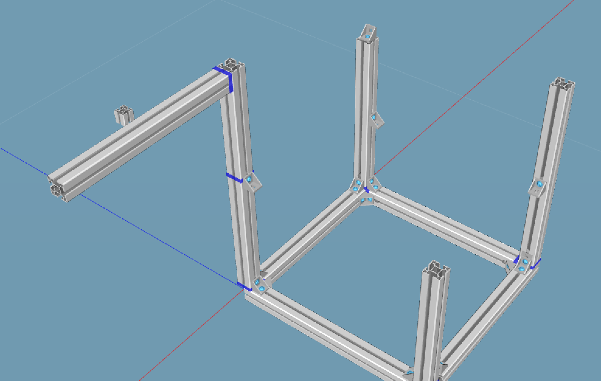

# 机械组⚙️任务

## 01护身 围绕着机器人底盘的护身是在激烈比赛中维护机器人安全的圆
柱、棱柱或其它异形结构，其外侧有缓冲撞击的发泡橡胶保护条，
名义厚度不得小于 40mm。护身的高度为 300mm，
其一簇水平横截面边界曲线包络圆直径不得超过 800mm。
护身与比赛场地表面垂直，离地高度不得超过 50mm
#### 红色或蓝色

## 02本届 Robocon 所用的篮球是标准尺寸
 7 号篮球，外周径 750～770mm（直径
239～245.1mm），重 580～620 g，
深棕色球皮，有黑色条纹。

## 03运球dribble机构
机器人与持有的球脱离后，球落到比赛区地面并反弹被该机器
人回收的过程。

## 04投篮shot
投篮是攻方机器人在本队进攻区内完全释放篮球并将它投向对
方篮筐的动作。

## 维护日志：

#### DP
250114 机械组⚙️任务

####  @卢王淳 
250114 参与机械组组会

## tip
- 两台机器人（包括电池、控制器、电缆、备用机构、泡沫橡胶保护条和设备）的总
重量不得超过 50kg

- 13 机器人
13.1 机器人的结构和尺寸
13.1.1 比赛开始前，每台机器人必须能纳入直径 800mm、高 1500mm 的圆柱。
13.1.2 在任何时刻，机器人护身的结构和尺寸应符合术语 2 定义的要求。
13.1.3 比赛中，机器人在护身上方的部分，直径可伸展到 1200mm，最大高度可达 2.4m。
13.1.4 运输时，机器人应能装入 1000mm 长、1600mm 宽、1000mm 高的木箱。参赛队必
须设计和制作适合木箱尺寸的机器人。

- 6.5 传球
6.5.1 为了有效，球必须从至少 1000mm（两机器人的最接近点的间距）以外扔向预定的接
球机器人。

