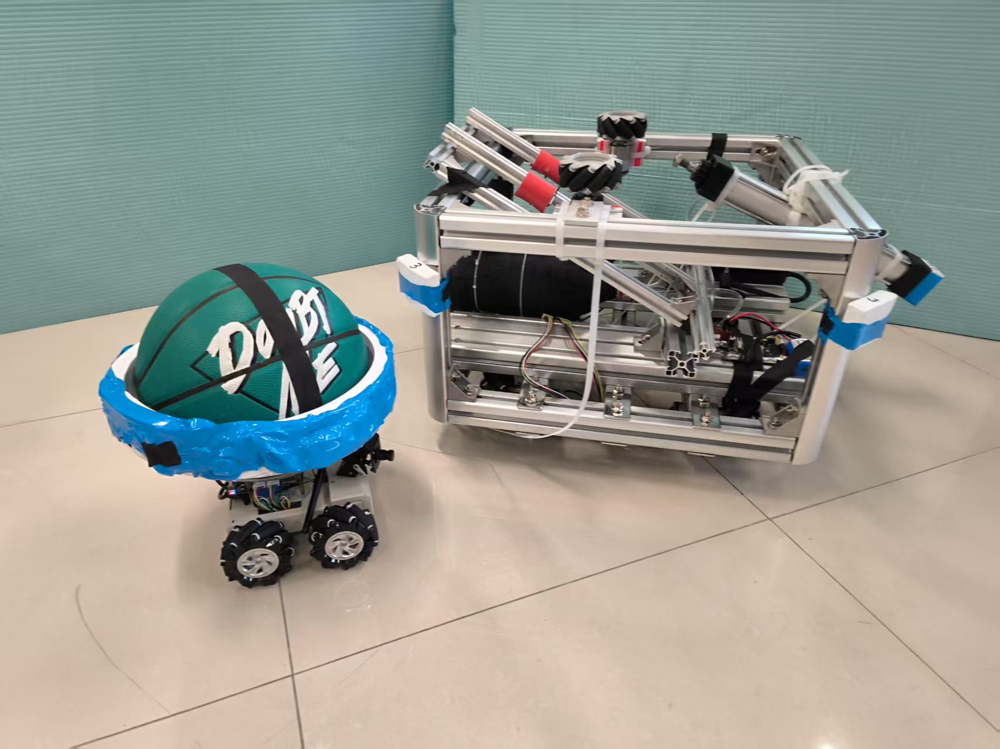

## 成员
|序号 |职位 | 姓名  | ID|
|---|---|---|---|
| 1 |组长|刘锦和| @浮生若梦 |
| 2 |成员|卢王淳| @卢王淳 |
| 3 |成员|王栏霖 | @临江踏雨未返 |
| 4 |24级小组长|彭柯尹| @彭柯尹 |
| 5 |成员|曹越| @曹越 |
| 6 |成员|王湘军| @王湘军 |
| 7|成员|郑钦文| @郑钦文 |
| 8|成员|孙如婕| @siu杰00 |
| 9|成员|吉舒洁| @吉舒洁 |
| 10|成员|邵仁昱| @邵仁昱|

 

---
## 机械组⚙️任务：
### **R1**机器人：
#### 护身✅    
#### 底部四轮足结构✅
#### 升降机90% （待数据材料交接，采买）
#### 搓轮+气泵传动 固件→彭柯尹_ @彭柯尹 
#### 舵轮→郑钦文_ @郑钦文 

### **R2**机器人：
#### 人形/横向任务→刘锦和_ @浮生若梦 
#### 绘制打印→王于豪_ @王于豪041005  @王露洁041101 

---

## 小组讨论区😶‍🌫️😲✨：

---
##  比赛要求：
### 1.比赛用球🏀
#### 本届 Robocon 所用的篮球是标准尺寸7 号篮球，外周径 750～770mm（直径239～245.1mm），重 580～620 g，深棕色球皮，有黑色条纹。

### 2.**两台**机器人🤖
#### **①护身**
围绕着机器人底盘的护身是在激烈比赛中维护机器人安全的圆柱、棱柱或其它异形结构，其外侧有缓冲撞击的发泡橡胶保护条，名义厚度不得小于 40mm。护身的高度为 300mm，其一簇水平横截面边界曲线包络圆直径不得超过 800mm。护身与比赛场地表面垂直，离地高度不得超过 50mm
红色或蓝色
#### **②运球dribble机构**
机器人与持有的球脱离后，球落到比赛区地面并反弹被该机器人回收的过程。

#### **③投篮shot机构**
投篮是攻方机器人在本队进攻区内完全释放篮球并将它投向对方篮筐的动作。

---
## Tip❤️
#### 两台机器人（包括电池、控制器、电缆、备用机构、泡沫橡胶保护条和设备）的总重量不得超过 50kg
#### 机器人（机器人的结构和尺寸）
- ① 比赛开始前，每台机器人必须能纳入直径 800mm、高 1500mm 的圆柱。
- ② 在任何时刻，机器人护身的结构和尺寸应符合术语 2 定义的要求。
- ③ 比赛中，机器人在护身上方的部分，直径可伸展到 1200mm，最大高度可达 2.4m。
- ④ 运输时，机器人应能装入 1000mm 长、1600mm 宽、1000mm 高的木箱。参赛队必
须设计和制作适合木箱尺寸的机器人。
#### 传球
为了有效，球必须从至少 1000mm（两机器人的最接近点的间距）以外扔向预定的接球机器人。

---
## 安装进度🏃‍♂️‍➡️

---
## 实验剩余铝材🔩 需要重新统计
| 铝材长度 | 根数 |
|----------|------|
| 42cm     | 4    |
| 40cm     | 9    |
| 14cm     | 9    |
| 8cm      | 9    |
| 6cm      | 2    |
---
## 维护日志📓：
#### 250308  @卢王淳 机械组进度更新
#### 250324  @卢王淳 进度和人员更新
#### 250325  @曹越 安装软件
#### 250325  @孙如婕 安装软件
#### 250325  @彭柯尹 安装软件
#### 250325  @吉舒洁 安装软件
#### 250331  组员完成基本零件设计
#### 250401  @邵仁昱 进行装配
#### 250402  主要负责人讨论确定中期检测方案：气动装置
#### 250409   @彭柯尹  @卢王淳  @单广志 @崔正阳 安装完成中期检测发球装置
#### 250430   @DarrenPig 对机械组进行分工和任务安排

---

机械图纸** 
百度网盘：https://pan.baidu.com/s/1fjMW7g9zQfWwaDRmbepnww?pwd=8888 
提取码:8888
【备用夸克网盘，下载更快】
链接：https://pan.quark.cn/s/74e680a1783f
提取码：D4XV

百度网盘链接: https://pan.baidu.com/s/1Uh7PgGlxNxghdW2g_wh8oA?pwd=8888 
提取码: 8888 

【备用夸克网盘，下载更快】
链接：https://pan.quark.cn/s/3937552cba36
提取码：j6bj

链接：https://pan.baidu.com/s/1fjMW7g9zQfWwaDRmbepnww?pwd=8888 
提取码:8888

链接：https://pan.baidu.com/s/1q5CYWZu2qm4OTV5Cb_3F8Q?pwd=8888 
提取码：8888 

链接：https://pan.baidu.com/s/1fU57t5LUnv7MZXY-dB0FKA 
提取码：6666 

链接：https://pan.baidu.com/s/1Br8vvkiS3YGGjmcoN2HSVA 
提取码：2222 
复制这段内容打开「百度网盘APP 即可获取」
重要‼️链接易失效！！！务必保存转存到自己的百度网盘！资料转存后查看以防乱码！！

 