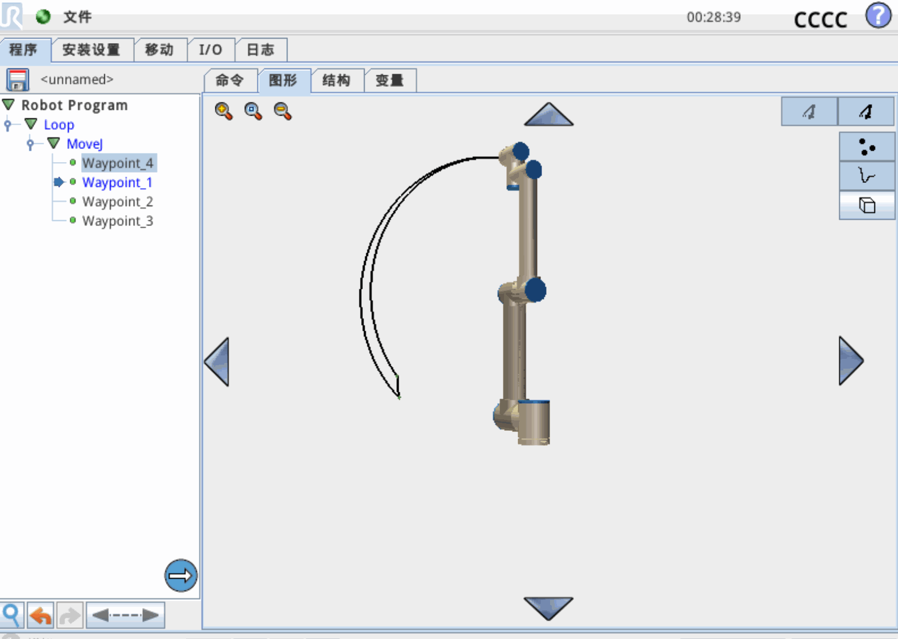

<!-- Improved compatibility of back to top link: See: https://github.com/othneildrew/Best-README-Template/pull/73 -->
<a id="readme-top"></a>

<!-- PROJECT LOGO -->
<br />
<div align="center">
  <a href="https://gitee.com/darrenpig/new_energy_coder_club">
    
  </a>

  <h1 align="center">NEC 新能源开发者社区</h1>
  <p align="center"><strong>面向新能源 × 机器人竞赛与实战项目的开源工程社区</strong></p>
  <p align="center">
    <a href="https://www.newenergycoder.club"><strong>官网（Website）»</strong></a>
    &nbsp;|&nbsp;
    <a href="./docs/start-here/60min.md"><strong>快速上手（Get Started）»</strong></a>
    &nbsp;|&nbsp;
    <a href="./docs/README.md"><strong>文档（Docs）»</strong></a>
  </p>
</div>

---

# NEC · New Energy Coder Community

[](LICENSE)[](https://gitee.com/darrenpig/new_energy_coder_club/issues/IDATOS)[](https://github.com/darrenpig/new_energy_coder_club/issues)[](https://github.com/darrenpig/new_energy_coder_club/pulls)[](docs/)
[](https://github.com/darrenpig/new_energy_coder_club/releases)[](https://github.com/darrenpig/new_energy_coder_club)[](https://www.newenergycoder.club/)[](https://scn0bdoc8zxg.feishu.cn/wiki/S10LwzVZdiWLwxkEnEqcTcmEn6e)

## About NEC
NEC 是面向新能源与机器人竞赛的开源工程社区，提供模块化工程基线与赛季全周期资产，支持线上协作与 A416 线下实验室联动。

### ⚡ 为什么选择 NEC？（Community Features）

NEC 诞生于自由的开源文化之上，立足新能源与机器人技术浪潮，连接来自不同背景、不同学科的个体。  
这里不仅是线上协作网络，更有 A416 仓库实验室 这样的线下据点；不仅是团队，更是持续追踪前沿技术的无数个人⚡。

<table align="center">
  <tr>
    <td width="33%" align="center" valign="top">
      <br />
      <b>🚀 搞事情：机器人军火库</b><br />
      <ul style="text-align:left">
        <li>竞赛全周期资产（2022–2026）</li>
        <li>82 套 FRC 机械图纸、标准化铝方型材库</li>
        <li>完整记录 CURC-ROBOCON 从 0 到 1 的过程</li>
        <li>FRC → ROBOCON 的补给链与起步文档</li>
      </ul>
    </td>
    <td width="33%" align="center" valign="top">
      <br />
      <b>🧩 极客风：模块化乐高</b><br />
      <ul style="text-align:left">
        <li>极简 + 模块化工程哲学</li>
        <li>openEuler / RT-Thread 技术栈</li>
        <li>BSP 像乐高积木一样解耦重组</li>
        <li>线上 + 线下，百人协作的实战经验</li>
      </ul>
    </td>
    <td width="33%" align="center" valign="top">
      <br />
      <b>🎒 秘籍：哆啦 A 梦口袋</b><br />
      <ul style="text-align:left">
        <li>机械设计 → 控制算法 → 参数调优全链路文档</li>
        <li>真实项目一线经验与关键决策复盘</li>
        <li>野生导师式教程，小白极度友好</li>
        <li>技术快感与团队记忆同样重要</li>
      </ul>
    </td>
  </tr>
</table>

## 🤝 贡献与规范
<table>
  <tr>
    <td valign="top" width="50%">
      <h4>📋 贡献方式</h4>
      <ul>
        <li>🐛 问题反馈：在 Issues 中报告 bug 或提出建议</li>
        <li>💡 功能建议：提出新功能想法或改进建议</li>
        <li>📝 文档完善：改进文档、添加教程或翻译内容</li>
        <li>💻 代码贡献：提交代码修复或新功能实现</li>
        <li>🎨 设计贡献：提供 UI/Logo/3D 模型等设计资源</li>
      </ul>
      <h4> 📚 更多信息</h4>
      <ul style="text-align:left">
        <li>详细的贡献指南请参考：[CONTRIBUTING.md](./CONTRIBUTING.md)</li>
        <li>代码规范请参考：[CODE_OF_CONDUCT.md](./CODE_OF_CONDUCT.md)</li>
      </ul>
    </td>
    <td valign="top" width="50%">
      <h4>🔧 开发规范</h4>
      <ul>
        <li>代码风格：遵循各语言的标准编码规范</li>
        <li>提交规范：使用清晰的 commit message（格式：<code>[类型] 简短描述</code>）</li>
        <li>
          类型参考：
          <ul>
            <li><code>[feat]</code> 新功能</li>
            <li><code>[fix]</code> 修复 bug</li>
            <li><code>[docs]</code> 文档更新</li>
            <li><code>[style]</code> 代码格式调整</li>
            <li><code>[refactor]</code> 代码重构</li>
          </ul>
        </li>
        <li>分支管理：从 <code>master</code> 创建 feature 分支，完成后提交 PR</li>
        <li>测试要求：新功能需包含相应的测试用例（或最小可运行 Demo）</li>
      </ul>
    </td>
  </tr>
</table>

---


## 关于本仓库（What / Why / Who）
- What it is? 双驱动型开源仓库：竞赛（ROBOCON 等）+ 项目（Duma 人形、NearLink 等）
- Why use it? 大规模资料库与基线工程，项目模板与最小 Demo，路径统一（短标签）
- Who is it for? 机械 / 硬件 / 软件 / 运营（新人可从文档与最小 Demo 开始）

## 🧭 Start Here（导航）
- 快速上手: [60min](./docs/start-here/60min.md) · [First Good Issue](./docs/start-here/first-good-issue.md)
- 学习路线: [岗位路线图](./docs/learn/roles.md)
- 竞赛与项目: [竞赛](./competitions/README.md) · [项目](./projects/README.md)
- 社区与团队: [维护者/SIG](./docs/community/maintainers.md) · [团队与致谢](./docs/community/TEAM.md)


# 📁 仓库结构

本仓库采用**双驱动型**组织方式，分为竞赛驱动型和项目驱动型两大类别，便于管理和查找内容。

## 📁 仓库架构（Architecture）

```
new_energy_coder_club/
├── 🏆 competitions/      # 竞赛驱动：Robocon/智能车等历年备赛资源
├── 🚀 projects/          # 项目驱动：人形机器人/AI算法/嵌入式开发
├── 📚 docs/              # 社区核心：新手引导/学习路线/贡献指南
├── 🛠️ shared/            # 共享资源：3D 模型(STEP)/硬件封装库
└── 🤝 CONTRIBUTING.md    # 参与准则：如何提交代码与认领 Issue
```

- 我该去哪里找什么：竞赛资产 → [competitions](./competitions/README.md)；做项目 → [projects](./projects/README.md)；新人 → [docs/start-here](./docs/start-here/60min.md)
- 官网（Landing）→ [newenergycoder.club](https://www.newenergycoder.club/)
- 知识库（Feishu Wiki）→ [入口](https://scn0bdoc8zxg.feishu.cn/wiki/S10LwzVZdiWLwxkEnEqcTcmEn6e)

- `images/`: 图片资源
  - `Image/`: 项目Logo、路线图等核心图片
  - `competition/`: 竞赛相关图片
  - `project/`: 项目展示图片
  - `team/`: 团队合照
  - `technical/`: 技术文档图片
- `models/`: 3D模型文件
  - 包含各种机械零件的STEP格式文件
  - 电机、轮毂、联轴器等标准件模型

## 🧭 快速导航指南
<table>
  <tr>
    <td valign="top" width="50%">
      <h4>📍 项目查找</h4>
      <ul>
        <li>🏆 竞赛项目：<code>competitions/[年份]/[竞赛名称]</code></li>
        <li>🔬 技术项目：<code>projects/[技术领域]/[项目名称]</code></li>
        <li>📦 共享资源：<code>shared/[资源类型]</code></li>
      </ul>
      <h4>Project Profile 项目简介</h4>
      <p>目前是一个开源项目，想要做 1W 以内的人形机器人与轮腿机器狗，同时兼顾高校开发者的 ROBOCON 竞赛需求、设计师的落地实践，以及大家的有趣技术追求。</p>
      <p>我们将在 2 个月内快速开发人形机器人 2+ 场景，并通过广泛的横向项目维护与贡献。希望这段经历成为大家难忘的开源团队记忆。——DarrenPig</p>
      <h5>分支组成</h5>
      <ul>
        <li>竞赛（3+ing） + 科研（IEEE/课设） + 横向项目（委托/合作） + 开源运营（社群/社区）</li>
        <li>Internet_of_Things_Design_Competition 物联网项目</li>
        <li>Electronic_design_competition 电子设计项目</li>
        <li>Energy_conservation_and_emission_reduction_competition 新能源项目</li>
        <li>main（案例 Demo 集中展示的分支）商业项目</li>
      </ul>
    </td>
    <td valign="top" width="50%">
      <h4>🔥 热门项目快速入口</h4>
      <ul>
        <li><a href="./projects/README.md">📁 项目总览</a> - 查看所有项目分类和导航</li>
        <li><a href="./competitions/2025robocon/">🤖 2025 ROBOCON</a> - 全国大学生机器人竞赛</li>
        <li><a href="./projects/robotics/humanoid-robot/">🦾 人形机器人</a> - Duma小型人形机器人项目</li>
        <li><a href="./projects/embedded/20250426星闪手柄/">⚡ 星闪技术</a> - 新一代无线通信技术</li>
        <li><a href="./projects/ai/5axis-fluid-workstation/">🧠 5轴流体工作站</a> - 智能能源管理系统 · <a href="https://github.com/Darrenpig/5-axis-fluid-workstation">GitHub</a></li>
        <li><a href="./projects/robotics/mechdog-k230-kfs/">🐶 轮腿机器狗 K230 KFS</a> - 基于K230/KFS的轮腿机器狗工程</li>
        <li><a href="./docs/start-here/60min.md">🚀 Quickstart（新人上手）</a> · <a href="./docs/start-here/first-good-issue.md">First Good Issue</a> · <a href="https://gitee.com/darrenpig/new_energy_coder_club/issues">Join</a></li>
        <li><a href="./projects/科研「横向项目」/README.md">🔬 科研横向项目</a> - 产学研合作项目总览</li>
        <li><a href="./projects/科研「横向项目」/mica-validation/README.md">🎯 MICA验证项目</a> - 关键性验证与文档系统</li>
        <li><a href="./projects/templates/README.md">🛠️ 项目模板</a> - 标准化开发模板</li>
      </ul>
    </td>
  </tr>
</table>

## 📊 项目快览（Project Overview）
| 项目名称 | 分类 | 状态 | 快速通道 |
|---|---|---|---|
| 🤖 2025 ROBOCON | 竞赛 | 🟢 开发中 | [赛季仓](./competitions/2025robocon/) / [竞赛索引](./docs/build/competition_index.md) |
| 🦾 Duma 人形机器人 | 项目 | 🟡 维护中 | [项目主页](./projects/robotics/humanoid-robot/) / [岗位路线图](./docs/learn/roles.md) |

<table>
  <tr>
    <td valign="top" width="50%">
      <h4>2025 ROBOCON 组别快速入口</h4>
      <ul>
        <li><a href="./competitions/2025robocon/上位机组.md">📄 上位机组</a></li>
        <li><a href="./competitions/2025robocon/上位机组_运球机构.md">📄 上位机组_运球机构</a></li>
        <li><a href="./competitions/2025robocon/算法组.md">📄 算法组</a></li>
        <li><a href="./competitions/2025robocon/硬件组.md">📄 硬件组</a></li>
        <li><a href="./competitions/2025robocon/运营组.md">📄 运营组</a></li>
        <li><a href="./competitions/2025robocon/采购组.md">📄 采购组</a></li>
        <li><a href="./competitions/2025robocon/队伍结构.md">📄 队伍结构</a></li>
      </ul>
    </td>
    <td valign="top" width="50%">
      <h4>科研「横向项目」快速入口</h4>
      <ul>
        <li><a href="./projects/科研「横向项目」/3d-printing-sig.md">📄 3d-printing-sig</a></li>
        <li><a href="./projects/科研「横向项目」/AGL-openEuler.md">📄 AGL-openEuler</a></li>
        <li><a href="./projects/科研「横向项目」/dexterous-hand.md">📄 dexterous-hand</a></li>
        <li><a href="./projects/科研「横向项目」/pneumatic-system.md">📄 pneumatic-system</a></li>
        <li><a href="./projects/robotics/mechdog-k230-kfs/">📄 K230-KFS</a></li>
        <li><a href="./projects/ai/5axis-fluid-workstation/">📄 5轴流体工作站</a></li>
      </ul>
    </td>
  </tr>
</table>

### 📊 项目状态概览
| 类别 | 活跃项目数 | 状态 | 最近更新 |
|------|-----------|------|----------|
| 🏆 竞赛项目 | 9个 | 🟢 活跃 | 2025-11 |
| 🤖 机器人项目 | 3个 | 🟢 活跃 | 2025-10 |
| 🔬 AI项目 | 2个 | 🟡 开发中 | 2024-12 |
| 🔬 科研横向项目 | 4个 | 🟢 活跃 | 2025-10 |
| ⚡ 嵌入式项目 | 2个 | 🟢 活跃 | 2025-08 |


> NEC 团队成员们的合照


<!-- Follow is usage -->
<!-- TABLE OF CONTENTS -->


<!-- ABOUT THE PROJECT -->
## About The Project 关于项目
#### **「DarrenPig新能源开发者社区」** 是一个以 **技术共享与实践成长为核心** 的开源协作平台，适合以下人群加入：  

1. **竞赛科研小白**：提供 **全国大学生机器人大赛** 全周期备赛资源ROBOCON，包括FRC图纸、硬件设计模板、嵌入式开发案例，助力从理论到落地的完整闭环。  
2. **新能源与机器人爱好者**：聚焦新能源技术、IOT与自动化控制，结合openEuler等开源生态，探索智能硬件与可持续能源的交叉创新。  
3. **全栈开发者训练营**：通过实际项目（如机器人BSP开发、MayCAD设计）积累经验，社区成员协作解决真实问题，打造可复用的技术案例。  
4. **开源贡献者孵化地**：参与社区文档维护、代码提交，与40+开发者共同成长，你的每一次都可能成为他人眼中的「闪光之处」。  
### 一句话灵魂总结：  

这里是 **「技术宅的游乐场」** + **「竞赛党的弹药库」**，用开源精神点燃新能源与机器人的未来！🚀  
（想一起造轮子or抱团打比赛？速戳：[仓库传送门](https://gitee.com/darrenpig/new_energy_coder_club)）


   [](https://github.com/Darrenpig/new_energy_coder_club/graphs/contributors) 
[](https://github.com/Darrenpig/new_energy_coder_club/pulls)
 
[](https://github.com/users/Darrenpig/projects/3)


### Roadmap 项目探索地图
                      
---

<!-- CONTACT -->
## 📬 **Contact 联系我们**  
想和我们快速搭上线？看这里！  

- **💡 建议 & 合作**：欢迎来 [Gitee Issues 区](https://gitee.com/darrenpig/new_energy_coder_club/issues ) 提需求！无论是项目合作还是功能建议，我们都会仔细阅读并标记为 `讨论中`/`已采纳`   
- **🌐 社交阵地**：  
  - **Gitee 动态**：[项目主页](https://gitee.com/darrenpig/new_energy_coder_club) 实时更新代码与公告  
  - **官方网站**：[newenergycoder.club](https://www.newenergycoder.club) 获取最新活动、文档与社区介绍  
  - **小红书达人**：关注 [DarrenPig](https://www.xiaohongshu.com/user/profile/62f2899b000000001f0074f1) 获取技术段子与新能源黑科技  
  - **微信社群**：[扫码](darrenpig.blog.csdn.net)加入开发者群（详情边栏底部名片），随时在线交流💬  

**🚀 小贴士**  

- **项目双平台同步**：代码仓库同时在 [GitHub](https://github.com/Darrenpig/new_energy_coder_club ) 和 [Gitee](https://gitee.com/darrenpig/new_energy_coder_club) 维护，国内推荐用 [Gitee](https://gitee.com/darrenpig/new_energy_coder_club) 加速访问   
<a id="ack-list"></a>
- **赞助与合作**：企业级合作请联系邮箱22230635@czu.cn，开源贡献者请直接提 PR，你的名字将闪耀在**致谢名单** 🌟  
- **紧急问题**：邮件标题加注【紧急】，我们会优先处理！  

**🙌 期待你的加入**  
无论是想托管项目、参与开发，还是单纯唠嗑技术，我们都敞开大门！用你的奇思妙想，点亮新能源编程社区吧～ 🚀  

---

### 📚 更多信息
详细的贡献指南请参考：[CONTRIBUTING.md](./CONTRIBUTING.md)

<p align="right">(<a href="#readme-top">back to top</a>)</p>


<!-- ACKNOWLEDGMENTS -->
## 许可与合规（License & Compliance）
- 主许可证: MIT（代码与文档遵循 MIT，见 [LICENSE](./LICENSE.md)）
- 资料与第三方声明: README/Docs 中的外部链接、赛季资料索引仅作导航，版权归原作者/主办方所有
- 安全与联系方式: 见 [SECURITY](./docs/SECURITY.md)，建议通过 Issues 报告安全问题
- 行为准则与治理: 见 [Code of Conduct](./docs/CODE_OF_CONDUCT.md) 与 [Governance](./docs/GOVERNANCE.md)
## 🙋 新人任务看板（Help Wanted）
- [Docs] 完善 2025 赛季运球机构文档  
  - 链接: ./competitions/2025robocon/  
  - 验收: 文档结构规范、含图片/步骤、可复现  
  - 预计: 2–3 小时  
  - Owner: RC-SIG
- [Hardware] 优化 ESP32 最小系统 PCB 丝印  
  - 链接: ./projects/embedded/  
  - 验收: 丝印清晰、针脚标注一致、Gerber 可导出  
  - 预计: 半天  
  - Owner: Embedded-SIG
- [Code] 为 Duma 机器人增加一个控制 Demo  
  - 链接: ./projects/robotics/humanoid-robot/  
  - 验收: README 说明、可运行脚本、演示视频/截图  
  - 预计: 1 天  
  - Owner: Robotics-SIG
→ 认领方式：在 Issue 评论 “I’d like to work on this” 或 `/assign me`，按 PR 模板提交
---

### References 参考文献

1.  React Icons Development Team. React Icons Search Interface. https://react-icons.github.io/react-icons/search (2024).
2.  远景资源团队. FRC机器人竞赛技术图纸资源库. http://pan.baidu.com/s/1zgAP8AmdhWhqjbqm_c0mog?pwd=v72M (2024).
3. 机械智库. SolidWorks标准零件库. https://shop128404759.taobao.com/ (2024).
4. 远景资源网. 工程技术资源共享平台. https://yuanjingziyuan.com/ (2024).
5. CSDN博主. GitHub Badge制作教程指南. https://blog.csdn.net/m0_74037814/article/details/139511804 (2024).
6. NEC新能源开发者社区. 2025全国机器人竞赛ROBOCON项目文档. ./competitions/2025robocon/ (2025).
7. ROBOCON组委会. 全国大学生机器人大赛ROBOCON技术论坛. https://ask.cnrobocon.net/ (2024).
8. DJI大疆创新. RoboMaster机甲大师赛官方技术论坛. https://bbs.robomaster.com/ (2024).
9. 立创EDA. 开源硬件平台OSHW HUB技术社区. https://oshwhub.com/explore (2024).
10. openEuler社区. 嵌入式SIG雪球计划南向BSP支持项目. https://gitee.com/openeuler/yocto-meta-openeuler/issues/I90DOU#comment-loadder (2024).
11. 中科院软件研究所. 开源之夏AGL智能汽车项目. https://gitee.com/openeuler/open-source-summer/issues/IC3VLM#note_43627656 (2024).
12. 深圳北理莫斯科大学. RoboMaster北极熊战队开源项目. https://gitee.com/SMBU-POLARBEAR (2024).
13. 湖南大学跃鹿战队. RoboMaster电控通用嵌入式框架. https://gitee.com/hnuyuelurm/basic_framework (2024).
14. UC Berkeley. Berkeley Humanoid Lite开源人形机器人项目. https://lite.berkeley-humanoid.org/ (2025).
15. 重庆邮电大学HXC团队. ESP32开发板套件开源硬件设计. https://oshwhub.com/qingmeijiupiao/esp32robo (2024).

---

## 🚀 快速上手

想要快速了解项目？观看下面的演示动画：


*UR机器人路径规划演示 - 展示机器人运动控制能力*

  
*百度网盘加速功能演示 - 展示文件传输优化效果*

### 快速开始步骤：
1. **克隆仓库**: `git clone https://gitee.com/darrenpig/new_energy_coder_club`
2. **查看项目**: 浏览 `projects/` 目录选择感兴趣的项目
3. **环境配置**: 参考各项目的 `README.md` 进行环境搭建
4. **运行演示**: 按照项目文档运行示例代码

---

仓库：new_energy_coder_club 开源人形仓库 Gitee X Github 双向
地址：江苏省常州市新北区辽河路666号 玉衡A416仓库
网址：https://gitee.com/darrenpig/new_energy_coder_club

 **前沿技术机器人No.24**

---

© 2025 NEC All Right Reserved.

---

苏ICP备2025187096号-1X
