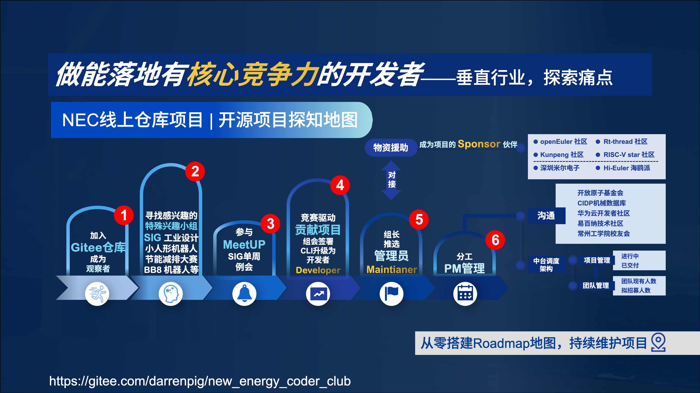

<!-- Improved compatibility of back to top link: See: https://github.com/othneildrew/Best-README-Template/pull/73 -->
<a id="readme-top"></a>

<!-- PROJECT LOGO -->
<br />
<div align="center">
  <a href="https://gitee.com/darrenpig/new_energy_coder_club">
    
  </a>
  <h3 align="center">new_energy_coder_club</h3>

[](https://gitee.com/darrenpig/new_energy_coder_club/tree/master/2025%E5%85%A8%E5%9B%BD%E6%9C%BA%E5%99%A8%E4%BA%BA%E7%AB%9E%E8%B5%9B-ROBOCON)  
[](https://gitee.com/darrenpig/new_energy_coder_club/tree/master/2024%E6%99%BA%E8%83%BD%E8%BD%A6%E5%AE%A4%E5%A4%96%E8%B5%9B%E6%AF%94%E8%B5%9B)[](https://gitee.com/darrenpig/new_energy_coder_club/tree/master/2024%E8%8A%82%E8%83%BD%E5%87%8F%E6%8E%92%E5%A4%A7%E8%B5%9B_Nearlink%E5%B0%8F%E8%BD%A6)         [](https://gitee.com/darrenpig/new_energy_coder_club/tree/master/2024%E7%89%A9%E8%81%94%E7%BD%91%E8%AE%BE%E8%AE%A1%E7%AB%9E%E8%B5%9B_Huawei%E6%95%B0%E9%80%9A)[](https://gitee.com/darrenpig/new_energy_coder_club/tree/master/2024%E5%85%A8%E5%9B%BD%E6%9C%BA%E5%99%A8%E4%BA%BA%E7%AB%9E%E8%B5%9B_ROBOCON)
[](https://gitee.com/darrenpig/new_energy_coder_club/blob/master/LICENSE.md)
[](https://gitee.com/darrenpig/new_energy_coder_club/blob/master/README.md)
  <p align="center">
欢迎来到 「NEC新能源极客俱乐部」 —— 一个充满活力和脑洞的「开源游乐园」这里不仅是新能源、机器人爱好者的秘密基地，更是大学生竞赛党的「宝藏地图」  

- **「搞事情」属性拉满**：团队正在疯狂备战 **2025全国大学生机器人大赛**，囤积了82套FRC图纸、铝方型材设计库，甚至还有企业级网盘资料包，仿佛藏着一整个机器人军火库。  
- **「极客风」代码狂欢**：20多位全栈小白在这里捣鼓嵌入式开发、BSP底软，一边玩转openEuler和Rt-thread开源社区，一边把代码写成「乐高积木」——模块化、可复用，拼出无限可能。  
- **「野生导师」出没ing~**：从机械设计到算法调参，从竞赛攻略到科研经验，这里的文档像「哆啦A梦的口袋」，随时掏出你需要的秘籍攻略，助你从菜鸟进化成赛场扛把子。 
</div>
    <br />
    <a href="https://github.com/users/Darrenpig/projects/3/views/1"><strong>最新动态 下面是上述资料 »</strong></a>
    <br />
    <br />
    <a href="https://gitee.com/darrenpig/new_energy_coder_club/tree/master/2025%E5%85%A8%E5%9B%BD%E6%9C%BA%E5%99%A8%E4%BA%BA%E7%AB%9E%E8%B5%9B-ROBOCON">View NEC_RC 2025 赛季</a>
    ·
    <a href="https://gitee.com/darrenpig/new_energy_coder_club/issues/IC9NDX">【图纸+开发】仓库资料 ROS拓展板/esp/ps2/小车/FRC/舵轮/标准库"</a>
    ·
    <a href="https://pan.baidu.com/s/1NcGkC6xRrA6sJ226mdPGIA?pwd=6yq5">铝方型材设计MayCAD</a>
  </p>
</div>

# 📁 仓库结构

本仓库采用**双驱动型**组织方式，分为竞赛驱动型和项目驱动型两大类别，便于管理和查找内容。

## 📂 目录结构概览

```
new_energy_coder_club/
├── competitions/           # 竞赛驱动型项目
│   ├── 2024/              # 2024年度竞赛
│   └── 2025/              # 2025年度竞赛
├── projects/              # 项目驱动型开发 [详细说明](./projects/README.md)
│   ├── ai/                # 人工智能项目 [查看详情](./projects/ai/README.md)
│   ├── robotics/          # 机器人项目 [查看详情](./projects/robotics/README.md)
│   ├── embedded/          # 嵌入式项目 [查看详情](./projects/embedded/README.md)
│   ├── templates/         # 项目模板 [查看详情](./projects/templates/README.md)
│   └── 科研「横向项目」/    # 科研合作项目
├── shared/                # 共享资源库
│   ├── images/            # 图片资源
│   └── models/            # 3D模型文件
├── README.md              # 项目说明文档
├── CONTRIBUTING.md        # 贡献指南
└── LICENSE.md             # 开源协议
```

## 📋 详细目录结构

### 1. 竞赛驱动型 (competitions/)
按年份和竞赛类型组织，包含各年度参加的竞赛项目：

- `2024/`: 2024年度竞赛项目
  - `robocon/`: 全国机器人竞赛ROBOCON
  - `huawei-cloud-ai/`: 华为云（化工行业人工智能应用）
  - `smart-car-outdoor/`: 智能车室外赛
  - `iot-design-huawei/`: 物联网设计竞赛
  - `electronics-competition/`: 电赛预选
  - `energy-saving/`: 节能减排大赛

- `2025/`: 2025年度竞赛项目
  - `robocon/`: 全国机器人竞赛ROBOCON
  - `traffic-design/`: 交通设计大赛
  - `energy-saving/`: 节能减排大赛

### 2. 项目驱动型 (projects/)
按技术领域和项目类型组织，促进跨竞赛项目的技术复用：

- `ai/`: 人工智能相关项目 [📖 详细说明](./projects/ai/README.md)
  - `energy-monitoring/`: 能源监测系统

- `robotics/`: 机器人相关项目 [📖 详细说明](./projects/robotics/README.md)
  - `humanoid-robot/`: 人形机器人开发
  - `250510飞控通讯/`: 飞行控制系统

- `embedded/`: 嵌入式相关项目 [📖 详细说明](./projects/embedded/README.md)
  - `nearlink/`: 星闪技术开发

- `templates/`: 项目开发模板 [📖 详细说明](./projects/templates/README.md)
  - 提供AI、嵌入式、机器人等项目的标准化模板

- `科研「横向项目」/`: 科研合作项目 [📖 详细说明](./projects/科研「横向项目」/README.md)
  - `dexterous-hand/`: 人形机器人UMI低成本灵巧手项目
  - `pneumatic-system/`: 气缸控制系统开发
  - `3d-printing-team/`: 3D打印成型组
  - `mica-validation/`: MICA关键性验证项目 [📚 在线文档](./projects/科研「横向项目」/mica-validation/docs/build/html/index.html)
    - 📖 [GitHub Actions 部署指南](./projects/科研「横向项目」/mica-validation/docs/GITHUB_ACTIONS_DEPLOYMENT.md) - 完整的自动化部署配置
    - ✅ [部署检查清单](./projects/科研「横向项目」/mica-validation/docs/DEPLOYMENT_CHECKLIST.md) - 确保部署成功的逐步指南

### 3. 共享资源 (shared/)
各项目共用的资源和工具：

- `images/`: 图片资源
  - `Image/`: 项目Logo、路线图等核心图片
  - `competition/`: 竞赛相关图片
  - `project/`: 项目展示图片
  - `team/`: 团队合照
  - `technical/`: 技术文档图片
- `models/`: 3D模型文件
  - 包含各种机械零件的STEP格式文件
  - 电机、轮毂、联轴器等标准件模型

## 🧭 快速导航指南

### 📍 项目查找
- **🏆 竞赛项目**：`competitions/[年份]/[竞赛名称]` 
- **🔬 技术项目**：`projects/[技术领域]/[项目名称]`
- **📦 共享资源**：`shared/[资源类型]`

### 🔥 热门项目快速入口
- [📁 项目总览](./projects/README.md) - 查看所有项目分类和导航
- [🤖 2025 ROBOCON](./competitions/2025/robocon/2025全国机器人竞赛_ROBOCON/) - 全国大学生机器人竞赛
- [🦾 人形机器人](./projects/robotics/humanoid-robot/人形机器人主线/) - Duma小型人形机器人项目
- [⚡ 星闪技术](./projects/embedded/nearlink/20250426星闪手柄/) - 新一代无线通信技术
- [🧠 AI能源监测](./projects/ai/energy-monitoring/20250319流体工作站/) - 智能能源管理系统
- [🔬 科研横向项目](./projects/科研「横向项目」/README.md) - 产学研合作项目总览
- [🎯 MICA验证项目](./projects/科研「横向项目」/mica-validation/README.md) - 关键性验证与文档系统
- [🛠️ 项目模板](./projects/templates/README.md) - 标准化开发模板

### 📊 项目状态概览
| 类别 | 活跃项目数 | 状态 | 最近更新 |
|------|-----------|------|----------|
| 🏆 竞赛项目 | 9个 | 🟢 活跃 | 2025-01 |
| 🤖 机器人项目 | 3个 | 🟢 活跃 | 2025-01 |
| 🔬 AI项目 | 2个 | 🟡 开发中 | 2024-12 |
| 🔬 科研横向项目 | 4个 | 🟢 活跃 | 2025-01 |
| ⚡ 嵌入式项目 | 2个 | 🟢 活跃 | 2025-01 |


> NEC 团队成员们的合照

## Repositories 📦

| Title                                                           | Description                                                                             | License                                                                  |
|-----------------------------------------------------------------|-----------------------------------------------------------------------------------------|--------------------------------------------------------------------------|
| [🏆 2024年竞赛项目总览](./competitions/2024/README.md) | 2024年度所有竞赛项目的导航和概览 |  |
| [🤖 2024 ROBOCON](./competitions/2024/robocon/README.md) | 2024赛季RC团队的开发项目流程开源 |  |
| [🧠 2024华为云AI化工赛题](./competitions/2024/huawei-cloud-ai/README.md) | 提供"星闪智巡"项目的接口和开发基线 |  |
| [🚗 2024智能车室外赛](./competitions/2024/smart-car-outdoor/README.md) | 汽车工程学院机器人实验室提供的开发环境 |  |
| [🌐 2024物联网设计竞赛](./competitions/2024/iot-design-huawei/README.md) | 工业级边缘计算网关AR502H-CN 开发学习文档 |  |
| [⚡ 2024电子设计竞赛](./competitions/2024/electronics-competition/README.md) | 星闪通讯协议模块的Demo实验 |  |
| [2025全国大学生机器人竞赛-ROBOCON](https://gitee.com/darrenpig/new_energy_coder_club/tree/master/2025%E5%85%A8%E5%9B%BD%E6%9C%BA%E5%99%A8%E4%BA%BA%E7%AB%9E%E8%B5%9B-ROBOCON)     | 人形机器人开发 项目流程管理，项目基线  |  |
| [🌱 2024节能减排大赛](./competitions/2024/energy-saving/README.md) | 亚博智能 巡检小车Demo,研究esp32-UDP虚拟机 |  |


<!-- Follow is usage -->
<!-- TABLE OF CONTENTS -->


<!-- ABOUT THE PROJECT -->
## About The Project 关于项目
#### **「DarrenPig新能源开发者社区」** 是一个以 **技术共享与实践成长为核心** 的开源协作平台，适合以下人群加入：  

1. **竞赛科研小白**：提供 **全国大学生机器人大赛** 全周期备赛资源ROBOCON，包括FRC图纸、硬件设计模板、嵌入式开发案例，助力从理论到落地的完整闭环。  
2. **新能源与机器人爱好者**：聚焦新能源技术、IOT与自动化控制，结合openEuler等开源生态，探索智能硬件与可持续能源的交叉创新。  
3. **全栈开发者训练营**：通过实际项目（如机器人BSP开发、MayCAD设计）积累经验，社区成员协作解决真实问题，打造可复用的技术案例。  
4. **开源贡献者孵化地**：参与社区文档维护、代码提交，与40+开发者共同成长，你的每一次都可能成为他人眼中的「闪光之处」。  
### 一句话灵魂总结：  

这里是 **「技术宅的游乐场」** + **「竞赛党的弹药库」**，用开源精神点燃新能源与机器人的未来！🚀  
（想一起造轮子or抱团打比赛？速戳：[仓库传送门](https://gitee.com/darrenpig/new_energy_coder_club)）


   [](https://github.com/Darrenpig/new_energy_coder_club/graphs/contributors) 
[](https://github.com/Darrenpig/new_energy_coder_club/pulls)
 
[](https://github.com/users/Darrenpig/projects/3)

### Project Profile 项目简介
目前是一个开源项目，想要做 1W 以内的人形机器人，同时兼顾高校开发者的竞赛需求，设计师们的落地项目实践，以及大家的好玩技术的追求。
我们将在2 个月内快速开发人形机器人 2+ 场景，并且通过广泛的横向项目来维护贡献这个项目。希望贡献项目的经历可以成为大家以后美好的回忆。——DarrenPig
分支有以下的组成：
### 竞赛（3+ing） + 科研（IEEE 项目和专业课设） + 横向项目（委托外包和合作） + 开源运营（机器人社群和开源社区）
- Internet_of_Things_Design_Competition 物联网项目
- Electronic_design_competition 电子设计项目
- Energy_conservation_and_emission_reduction_competition 新能源项目
- main（案例 Demo 集中展示的分支）商业项目


### Roadmap 项目探索地图
                      
---

<!-- CONTACT -->
## 📬 **Contact 联系我们**  
想和我们快速搭上线？看这里！  

- **💡 建议 & 合作**：欢迎来 [Gitee Issues 区](https://gitee.com/darrenpig/new_energy_coder_club/issues ) 提需求！无论是项目合作还是功能建议，我们都会仔细阅读并标记为 `讨论中`/`已采纳`   
- **🌐 社交阵地**：  
  - **Gitee 动态**：[项目主页](https://gitee.com/darrenpig/new_energy_coder_club) 实时更新代码与公告  
  - **小红书达人**：关注 [DarrenPig](https://www.xiaohongshu.com/user/profile/62f2899b000000001f0074f1) 获取技术段子与新能源黑科技  
  - **微信社群**：[扫码](darrenpig.blog.csdn.net)加入开发者群（详情边栏底部名片），随时在线交流💬  

**🚀 小贴士**  

- **项目双平台同步**：代码仓库同时在 [GitHub](https://github.com/Darrenpig/new_energy_coder_club ) 和 [Gitee](https://gitee.com/darrenpig/new_energy_coder_club) 维护，国内推荐用 [Gitee](https://gitee.com/darrenpig/new_energy_coder_club) 加速访问   
- **赞助与合作**：企业级合作请联系邮箱22230635@czu.cn，开源贡献者请直接提 PR，你的名字将闪耀在**致谢名单** 🌟  
- **紧急问题**：邮件标题加注【紧急】，我们会优先处理！  

**🙌 期待你的加入**  
无论是想托管项目、参与开发，还是单纯唠嗑技术，我们都敞开大门！用你的奇思妙想，点亮新能源编程社区吧～ 🚀  

---

## 🤝 如何参与贡献

### 📋 贡献方式
1. **🐛 问题反馈**：在 [Issues](https://gitee.com/darrenpig/new_energy_coder_club/issues) 中报告bug或提出建议
2. **💡 功能建议**：提出新功能想法或改进建议
3. **📝 文档完善**：改进文档、添加教程或翻译内容
4. **💻 代码贡献**：提交代码修复或新功能实现
5. **🎨 设计贡献**：提供UI设计、Logo设计或3D模型

### 🔧 开发规范
- **代码风格**：遵循各语言的标准编码规范
- **提交规范**：使用清晰的commit message，格式：`[类型] 简短描述`
  - `[feat]` 新功能
  - `[fix]` 修复bug
  - `[docs]` 文档更新
  - `[style]` 代码格式调整
  - `[refactor]` 代码重构
- **分支管理**：从main分支创建feature分支，完成后提交PR
- **测试要求**：新功能需要包含相应的测试用例

### 📚 更多信息
详细的贡献指南请参考：[CONTRIBUTING.md](./CONTRIBUTING.md)

<p align="right">(<a href="#readme-top">back to top</a>)</p>


<!-- ACKNOWLEDGMENTS -->
## Acknowledgments 致谢 📂
Use this space to list resources you find helpful and would like to give credit to. I've included a few of my favorites to kick things off!感谢以下开源组件、资料、资源库的帮助

* [React Icons](https://react-icons.github.io/react-icons/search)
* [远景资源FRC图纸](http://pan.baidu.com/s/1zgAP8AmdhWhqjbqm_c0mog?pwd=v72M)
* [机械智库SW标准库](https://shop128404759.taobao.com/)
* [远景资源密码： www.yuanjingziyuan.com  ](https://yuanjingziyuan.com/)
* [badage教程链接](https://blog.csdn.net/m0_74037814/article/details/139511804)
## 感谢以下赞助伙伴，以及全体开发者们


我们衷心感谢那些来自萝马车圈、艾迈斯科技、深圳米尔电子、openEuler社区、易百纳社区、Rt-theard社区、NXP社区、华为云社区的合作伙伴，他们的软硬件支持，纪念品、连接器、工业主板、开发板和服务器代金券......为项目的进行提供了坚实的支持。

---
## 25.03.16 自动化流体监测站 合作开发new_energy_coder_club 苏州项目
 @GeyuanLi  @DarrenPig  @殷子豪 

|序号 |ID |负责 |职位 |  技能 |
|---|---|---|---|---|
|1 | @殷统创    |HMI界面   |负责人    | Qt绘图      |
|2 | @DarrenPig |需求对接  |负责人    | 方案提供    |
|3 | @杨鑫海    |硬件安装   |负责人   | 文档分析     |
|4 | @李一楠    |开发合规   |负责人   | 运营合规     |
|5 | @卞乐凌    |24 电三    |硬件成员 | 架构文档     |
|6 | @李硕      |24 电四    |硬件成员 | 焊接连线     |
|7 | @单广志    |仿真控制   |负责人  | 指令仿真     |
|8 | @郑钦文    |24 机二    |负责人  | MayCAD型材  |
|9 | @田旺旺    |24 信四    |硬件成员  | 上位机    | 
|10| @孙如婕    |24 机一   |负责人  | 机械设计   | 
<div align="center">  </p>


🎁 最后，特别感谢那些为项目注入“灵魂”的开发者们 @SaNgZi、@朱建超、@许子涵涵、@殷统创、@郝磊、@黄子澄，你们的卓越贡献，让项目变得更加生动而有质感。🎨
Thank you sincerely to the following partners and developers. It is your outstanding contributions that have endowed the project with a soul-like texture.

---
<p align="right">(<a href="#readme-top">back to top</a>)</p>

# 250516飞控Sig成立

## CIT项目成员

|序号 |赛季 |班级 |职位 | 名称  | 技能 |
|---|---|---|---|---|---|
| 1 | 24  | 22 能源二   | 项目管理         | 朱佩韦     | |
| 2 | 24  | 22 能源一   | 电控/上位机       | 殷统创     | |   
| 3 | 24  | 22 财一     | 财务总监         | 张若璐     ||
| 4 | 24  | 23 光电二   | 仓库维护/上位机    | 许子涵    ||
| 5 | 25  | 24 新能源   | 赛期管理          | 卢王淳    |  |
| 6 | 25  | 24 财一     | 财务组长          | 李晨      ||
| 7 | 25  | 24 航4      | 运营组长 例会主持  | 李一楠    ||
| 8 | 25  | 24汉二      | 赛季筹备/宣传      | 殷子豪    ||
| 9 | 25  | 24车辆二    | **队长**          | 刘英淇    ||
|10 | 25  | 24航4      | 运营组 上位机组     | 陈家辉    ||
|11 | 25  | 23光电二    | 硬件组组长         | 杨鑫海    ||
|12 | 25  | 23光电二    | 上位机组组长       | 崔正阳    ||
|13 | 25  | 22机二      | 机械组组长        | 周鹏程    ||
|14 | 25  | 22信二      | maintainer      | 许珑译    | |
|15 | 25  | 24大数据二   | 采购组长         | 郑绍恺    ||
|16 | 25  | 24数学二    | 成员             | 王子楚    ||
|17 | 25  | 24车辆二    | 成员             | 朱迪      ||
|18 | 25  | 24视传      | 成员             | 张岩皓    ||
|19 | 25  | 23光电二    | 硬件电控组组长        | 单广志    |  |
|20 | 25  | 23机二      | 机械组组长        | 刘锦和    ||
|21 | 25  | 23机三      | 成员             | 陈恺鑫    ||
|22 | 25  | 22计算机      | maintainer           | 闻志伟    | |


<p align="right">(<a href="#readme-top">back to top</a>)</p>

## 工业设计SIG
|序号 |Wechat ID | 方向 |职位 | 名称  | 技能 |
|---|---|---|---|---|---|
| 1 | wwwwlR6              | Wachter  | 需求对接        | @皎月        ||
| 2 | wyj102194728         | Designer  | **工业设计**    | @ikkOoOo    ||   
| 3 | wxid_h42wf4z6rjek22  | Designer  | 场景设计        | @陈思家     ||
| 4 | ryf456814327         | Sponsor   | 工业设计        | @洪都拉斯    ||
| 5 | yy2112248888         | Designer  | 三维建模        | @王璐瑶      ||
| 6 | zgj16788             | Wachter  | 三维建模        | @造梦暖屋    ||
| 7 | richellelee_77       | Designer  | 产品设计        | @richelle   ||  
| 8 | pky123678            | Developer | 机械设计        | @彭柯尹      ||    
| 9 | WULA114514_          | Wachter  | 数字设计        | @Ranjok     ||  
|10 | Lazymieie-ness            | Developer | 机械设计        | @孙如婕      ||
## 最近案例：Duma小人形机器人Demo

# 近期工作：
- 宇树 GO8010-6 电机驱动控制 https://vsislab.github.io/RoboTamer/
- 气缸控制 BinBin 开源
- ROBOCON 带队开发
---
目标链接：https://summerofcode.withgoogle.com/
---
仓库：new_energy_coder_club 开源人形仓库 Gitee X Github 双向
地址：江苏省常州市新北区辽河路666号 玉衡A416仓库
网址：https://gitee.com/darrenpig/new_energy_coder_club

 **前沿技术机器人No.24**