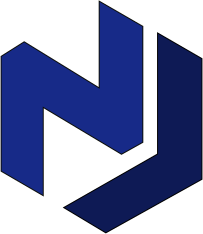
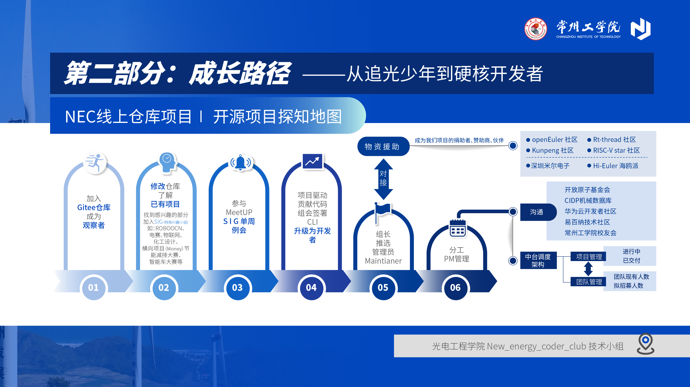
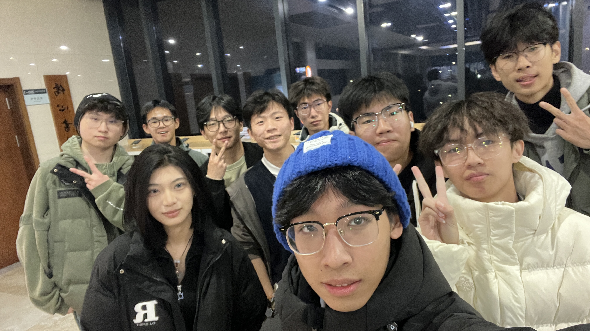

<!-- Improved compatibility of back to top link: See: https://github.com/othneildrew/Best-README-Template/pull/73 -->
<a id="readme-top"></a>
<!--
*** Thanks for checking out the new_energy_coder_club. If you have a suggestion
*** that would make this better, please fork the repo and create a pull request
*** or simply open an issue with the tag "enhancement".
*** Don't forget to give the project a star!
*** Thanks again! Now go create something AMAZING! :D
***
-->

<!-- PROJECT SHIELDS -->
<!--
*** I'm using markdown "reference style" links for readability.
*** Reference links are enclosed in brackets [ ] instead of parentheses ( ).
*** See the bottom of this document for the declaration of the reference variables
*** for contributors-url, forks-url, etc. This is an optional, concise syntax you may use.
*** https://www.markdownguide.org/basic-syntax/#reference-style-links
-->

<!-- PROJECT LOGO -->
<br />
<div align="center">
  <a href="https://gitee.com/darrenpig/new_energy_coder_club">
    
  </a>
  <h3 align="center">new_energy_coder_club</h3>

[](https://gitee.com/darrenpig/new_energy_coder_club/tree/master/2025%E5%85%A8%E5%9B%BD%E6%9C%BA%E5%99%A8%E4%BA%BA%E7%AB%9E%E8%B5%9B-ROBOCON)  
[](https://gitee.com/darrenpig/new_energy_coder_club/tree/master/2024%E6%99%BA%E8%83%BD%E8%BD%A6%E5%AE%A4%E5%A4%96%E8%B5%9B%E6%AF%94%E8%B5%9B)[](https://gitee.com/darrenpig/new_energy_coder_club/tree/master/2024%E8%8A%82%E8%83%BD%E5%87%8F%E6%8E%92%E5%A4%A7%E8%B5%9B_Nearlink%E5%B0%8F%E8%BD%A6)         [](https://gitee.com/darrenpig/new_energy_coder_club/tree/master/2024%E7%89%A9%E8%81%94%E7%BD%91%E8%AE%BE%E8%AE%A1%E7%AB%9E%E8%B5%9B_Huawei%E6%95%B0%E9%80%9A)[](https://gitee.com/darrenpig/new_energy_coder_club/tree/master/2024%E5%85%A8%E5%9B%BD%E6%9C%BA%E5%99%A8%E4%BA%BA%E7%AB%9E%E8%B5%9B_ROBOCON)
[](https://gitee.com/darrenpig/new_energy_coder_club/blob/master/LICENSE.md)
[](https://gitee.com/darrenpig/new_energy_coder_club/blob/master/README.md)
  <p align="center">
欢迎来到 「DarrenPig的新能源极客俱乐部」 —— 一个充满活力和脑洞的「开源游乐园」这里不仅是新能源、机器人爱好者的秘密基地，更是大学生竞赛党的「宝藏地图」  

- **「搞事情」属性拉满**：团队正在疯狂备战 **2025全国大学生机器人大赛**，囤积了82套FRC图纸、铝方型材设计库，甚至还有企业级网盘资料包，仿佛藏着一整个机器人军火库。  
- **「极客风」代码狂欢**：20多位全栈小白在这里捣鼓嵌入式开发、BSP底软，一边玩转openEuler和Rt-thread开源社区，一边把代码写成「乐高积木」——模块化、可复用，拼出无限可能。  
- **「野生导师」出没ing~**：从机械设计到算法调参，从竞赛攻略到科研经验，这里的文档像「哆啦A梦的口袋」，随时掏出你需要的秘籍攻略，助你从菜鸟进化成赛场扛把子。 
</div>
    <br />
    <a href="https://github.com/users/Darrenpig/projects/3/views/1"><strong>最新动态 下面是上述资料 »</strong></a>
    <br />
    <br />
    <a href="https://gitee.com/darrenpig/new_energy_coder_club/tree/master/2025%E5%85%A8%E5%9B%BD%E6%9C%BA%E5%99%A8%E4%BA%BA%E7%AB%9E%E8%B5%9B-ROBOCON">View NEC_RC 2025 赛季</a>
    ·
    <a href="https://pan.baidu.com/s/1zgAP8AmdhWhqjbqm_c0mog?pwd=v72M">82套2024FRC图纸链接 </a>
    ·
    <a href="https://pan.baidu.com/s/1W2RayBVYXKY17Z5m9e7jlA?pwd=veww">NEC团队企业百度网盘资料</a>
    ·
    <a href="https://pan.baidu.com/s/1NcGkC6xRrA6sJ226mdPGIA?pwd=6yq5">铝方型材设计MayCAD</a>
  </p>
</div>

## Repositories 📦

| Title                                                           | Description                                                                             | License                                                                  |
|-----------------------------------------------------------------|-----------------------------------------------------------------------------------------|--------------------------------------------------------------------------|
| [2024全国大学生机器人竞赛_ROBOCON](https://gitee.com/darrenpig/new_energy_coder_club/tree/master/2024%E5%85%A8%E5%9B%BD%E6%9C%BA%E5%99%A8%E4%BA%BA%E7%AB%9E%E8%B5%9B_ROBOCON) | 2024赛季RC团队的开发项目流程开源 |  |
| [2024首届数据要素AI化工赛题_华为云（AI人工智能）](https://gitee.com/darrenpig/new_energy_coder_club/tree/master/2024%E5%8D%8E%E4%B8%BA%E4%BA%91%EF%BC%88%E5%8C%96%E5%B7%A5%E8%A1%8C%E4%B8%9A%E4%BA%BA%E5%B7%A5%E6%99%BA%E8%83%BD%E5%BA%94%E7%94%A8%EF%BC%89)     | 提供“星闪智巡”项目的接口和开发基线 |  |
| [2024全国大学生智能车竞赛_室外赛比赛](https://gitee.com/darrenpig/new_energy_coder_club/tree/master/2024%E6%99%BA%E8%83%BD%E8%BD%A6%E5%AE%A4%E5%A4%96%E8%B5%9B%E6%AF%94%E8%B5%9B)           |汽车工程学院机器人实验室提供的开发环境    |  |
| [2024全国大学生物联网设计竞赛_Huawei数通](https://gitee.com/darrenpig/new_energy_coder_club/tree/master/2024%E7%89%A9%E8%81%94%E7%BD%91%E8%AE%BE%E8%AE%A1%E7%AB%9E%E8%B5%9B_Huawei%E6%95%B0%E9%80%9A)     | 工业级边缘计算网关AR502H-CN 开发学习文档|  |
| [2024全国大学生电子设计竞赛_电赛预选_EB25-SIG](https://github.com/FFTAI/Wiki-GRx-Gazebo)     | 星闪通讯协议模块的Demo实验    |  |
| [2025全国大学生机器人竞赛-ROBOCON](https://gitee.com/darrenpig/new_energy_coder_club/tree/master/2025%E5%85%A8%E5%9B%BD%E6%9C%BA%E5%99%A8%E4%BA%BA%E7%AB%9E%E8%B5%9B-ROBOCON)     | 人形机器人开发 项目流程管理，项目基线  |  |
| [2024全国大学生节能减排大赛](https://gitee.com/darrenpig/new_energy_coder_club/tree/master/2024%E8%8A%82%E8%83%BD%E5%87%8F%E6%8E%92%E5%A4%A7%E8%B5%9B_Nearlink%E5%B0%8F%E8%BD%A6)                              | 亚博智能 巡检小车Demo,研究esp32-UDP虚拟机   |    |

[](https://github.com/darrenpig/new_energy_coder_club/)
[](https://gitee.com/darrenpig/new_energy_coder_club/)
[](https://www.linkedin.com/in/darrenpig/)
[](https://space.bilibili.com/438904165)
[](https://weibo.com/u/5838027226)
[](https://gitee.com/darrenpig/new_energy_coder_club/blob/master/LICENSE.md)
[](https://gitee.com/darrenpig/new_energy_coder_club/blob/master/README.md)


<!-- Follow is usage -->
<!-- TABLE OF CONTENTS -->


<!-- ABOUT THE PROJECT -->
## About The Project 关于项目
#### **「DarrenPig新能源开发者社区」** 是一个以 **技术共享与实践成长为核心** 的开源协作平台，适合以下人群加入：  

1. **竞赛科研小白**：提供 **全国大学生机器人大赛** 全周期备赛资源，包括FRC图纸、硬件设计模板、嵌入式开发案例，助力从理论到落地的完整闭环。  
2. **新能源与机器人爱好者**：聚焦新能源技术、IoT与自动化控制，结合openEuler等开源生态，探索智能硬件与可持续能源的交叉创新。  
3. **全栈开发者训练营**：通过实际项目（如机器人BSP开发、MayCAD设计）积累经验，社区成员协作解决真实问题，打造可复用的技术模块。  
4. **开源贡献者孵化地**：参与社区文档维护、代码提交，与40+开发者共同成长，你的每一次都可能成为他人眼中的「救命稻草」。  
### 一句话灵魂总结：  

这里是 **「技术宅的游乐场」** + **「竞赛党的弹药库」**，用开源精神点燃新能源与机器人的未来！🚀  
（想一起造轮子or抱团打比赛？速戳：[仓库传送门](https://gitee.com/darrenpig/new_energy_coder_club)）


   [](https://github.com/Darrenpig/new_energy_coder_club/graphs/contributors) 
[](https://github.com/Darrenpig/new_energy_coder_club/pulls)
 
[](https://github.com/users/Darrenpig/projects/3)

### Project Profile 项目简介


                      
---

<!-- CONTACT -->
## 📬 **Contact 联系我们**  
想和我们快速搭上线？看这里！  

**✨ 高效联系方式**  
- **📩 邮件直通车**：直接发邮件到 [darrenpig@foxmail.com ](mailto:darrenpig@foxmail.com ) 最快！敲黑板——记得主题写清楚需求类型（合作/建议/托管），24 小时内必回   


- **💡 建议 & 合作**：欢迎来 [Gitee Issues 区](https://gitee.com/darrenpig/new_energy_coder_club/issues ) 提需求！无论是项目合作还是功能建议，我们都会仔细阅读并标记为 `讨论中`/`已采纳`   
- **🌐 社交阵地**：  
  - **Gitee 动态**：[项目主页](https://gitee.com/darrenpig/new_energy_coder_club ) 实时更新代码与公告  
  - **小红书达人**：关注 [DarrenPig](https://xiaohongshu.com/darrenpig ) 获取技术段子与新能源黑科技  
  - **微信社群**：[扫码](darrenpig.blog.csdn.net)加入开发者群（详情边栏底部名片），随时在线交流💬  

**🚀 小贴士**  

- **项目双平台同步**：代码仓库同时在 [GitHub](https://github.com/Darrenpig/new_energy_coder_club ) 和 [Gitee](https://gitee.com/darrenpig/new_energy_coder_club) 维护，国内推荐用 [Gitee](https://gitee.com/darrenpig/new_energy_coder_club) 加速访问   
- **赞助与合作**：企业级合作请联系邮箱22230635@czu.cn，开源贡献者请直接提 PR，你的名字将闪耀在**致谢名单** 🌟  
- **紧急问题**：邮件标题加注【紧急】，我们会优先处理！  

**🙌 期待你的加入**  
无论是想托管项目、参与开发，还是单纯唠嗑技术，我们都敞开大门！用你的奇思妙想，点亮新能源编程社区吧～ 🚀  

---

**🔗 快速跳转**  

- [项目主页](https://gitee.com/darrenpig/new_energy_coder_club ) | [GitHub 镜像](https://github.com/Darrenpig/new_energy_coder_club )  
- 致谢开源组件：React Icons、远景资源库等（密码见仓库内文档）   

---

> 💌 邮件模板参考：  
>
> ```  
> 主题：【合作/建议/托管】+ 需求简述  
> 正文：附上项目背景、预期目标及联系方式，我们会火速响应！  
> ```

<p align="right">(<a href="#readme-top">back to top</a>)</p>


<!-- ACKNOWLEDGMENTS -->
## Acknowledgments 致谢 📂
Use this space to list resources you find helpful and would like to give credit to. I've included a few of my favorites to kick things off!感谢以下开源组件、资料、资源库的帮助

* [React Icons](https://react-icons.github.io/react-icons/search)
* [远景资源FRC图纸](http://pan.baidu.com/s/1zgAP8AmdhWhqjbqm_c0mog?pwd=v72M)
* [机械智库SW标准库](https://shop128404759.taobao.com/)
* [远景资源密码： www.yuanjingziyuan.com  ](https://yuanjingziyuan.com/)
* [badage教程链接](https://blog.csdn.net/m0_74037814/article/details/139511804)
## 感谢以下赞助伙伴，以及全体开发者们


我们衷心感谢那些来自萝马车圈、艾迈斯科技、深圳米尔电子、openEuler社区、易百纳社区、Rt-theard社区、NXP社区、华为云社区的合作伙伴，他们的软硬件支持，纪念品、连接器、工业主板、开发板和服务器代金券......为项目的进行提供了坚实的支持。

---


<div align="center">  </p>


🎁 最后，特别感谢那些为项目注入“灵魂”的开发者们 @SaNgZi、@朱建超、@许子涵涵、@殷统创、@郝磊、@黄子澄，你们的卓越贡献，让项目变得更加生动而有质感。🎨
Thank you sincerely to the following partners and developers. It is your outstanding contributions that have endowed the project with a soul-like texture.

---
<p align="right">(<a href="#readme-top">back to top</a>)</p>