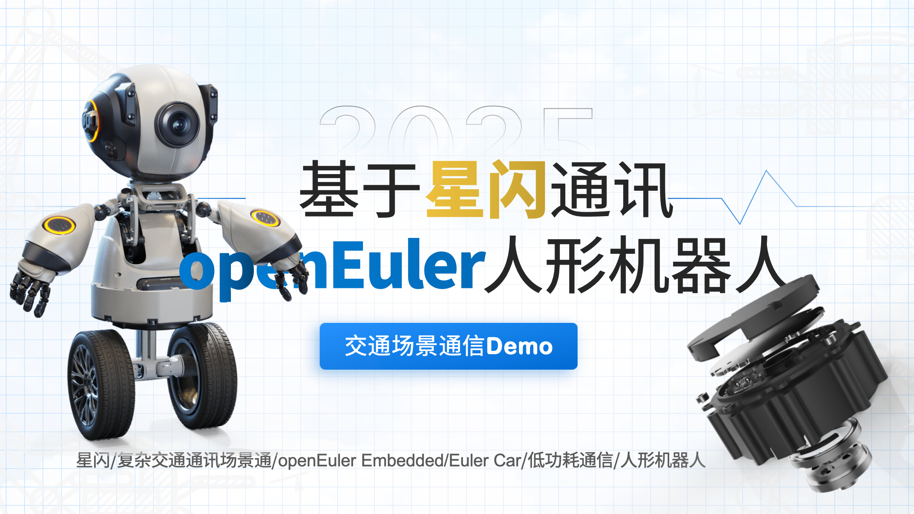

# 团队与致谢（TEAM）

## Acknowledgments 致谢 📂
Use this space to list resources you find helpful and would like to give credit to. I've included a few of my favorites to kick things off!感谢以下开源组件、资料、资源库的帮助
  
更多致谢名单请参见主仓库 README 的入口：[致谢名单](../../README.md#ack-list)

## 感谢以下赞助伙伴，以及全体开发者们

我们衷心感谢那些来自萝马车圈、艾迈斯科技、深圳米尔电子、openEuler社区、易百纳社区、RT-Theard社区、NXP社区、华为云社区的合作伙伴，他们的软硬件支持，纪念品、连接器、工业主板、开发板和服务器代金券......为项目的进行提供了坚实的支持。

---

## CIT项目成员

|序号 |赛季 |班级 |职位 | 名称  | 技能 |
|---|---|---|---|---|---|
| 1 | 24  | 22 能源二   | 项目管理         | 朱佩韦     | |
| 2 | 24  | 22 能源一   | 电控/上位机       | 殷统创     | |   
| 3 | 24  | 22 财一     | 财务总监         | 张若璐     ||
| 4 | 24  | 23 光电二   | 仓库维护/上位机    | 许子涵    ||
| 5 | 25  | 24 新能源   | 赛期管理          | 卢王淳    |  |
| 6 | 25  | 24 财一     | 财务组长          | 李晨      ||
| 7 | 25  | 24 航4      | 运营组长 例会主持  | 李一楠    ||
| 8 | 25  | 24汉二      | 赛季筹备/宣传      | 殷子豪    ||
| 9 | 25  | 24车辆二    | **队长**          | 刘英淇    ||
|10 | 25  | 24航4      | 运营组 上位机组     | 陈家辉    ||
|11 | 25  | 23光电二    | 硬件组组长         | 杨鑫海    ||
|12 | 25  | 23光电二    | 上位机组组长       | 崔正阳    ||
|13 | 25  | 22机二      | 机械组组长        | 周鹏程    ||
|14 | 25  | 22信二      | maintainer      | 许珑译    | |
|15 | 25  | 24大数据二   | 采购组长         | 郑绍恺    ||
|16 | 25  | 24数学二    | 成员             | 王子楚    ||
|17 | 25  | 24车辆二    | 成员             | 朱迪      ||
|18 | 25  | 24视传      | 成员             | 张岩皓    ||
|19 | 25  | 23光电二    | 硬件电控组组长        | 单广志    |  |
|20 | 25  | 23机二      | 机械组组长        | 刘锦和    ||
|21 | 25  | 23机三      | 成员             | 陈恺鑫    ||
|22 | 25  | 22计算机      | maintainer           | 闻志伟    | |

---

## 工业设计SIG
|序号 |Wechat ID | 方向 |职位 | 名称  | 技能 |
|---|---|---|---|---|---|
| 1 | wwwwlR6              | Wachter  | 需求对接        | @皎月        ||
| 2 | wyj102194728         | Designer  | **工业设计**    | @ikkOoOo    ||   
| 3 | wxid_h42wf4z6rjek22  | Designer  | 场景设计        | @陈思家     ||
| 4 | ryf456814327         | Sponsor   | 工业设计        | @洪都拉斯    ||
| 5 | yy2112248888         | Designer  | 三维建模        | @王璐瑶      ||
| 6 | zgj16788             | Wachter  | 三维建模        | @造梦暖屋    ||
| 7 | richellelee_77       | Designer  | 产品设计        | @richelle   ||  
| 8 | pky123678            | Developer | 机械设计        | @彭柯尹      ||    
| 9 | WULA114514_          | Wachter  | 数字设计        | @Ranjok     ||  
|10 | Lazymieie-ness            | Developer | 机械设计        | @孙如婕      ||

### 最近案例：Duma小人形机器人Demo

### 近期工作：
- 宇树 GO8010-6 电机驱动控制 https://vsislab.github.io/RoboTamer/
- 气缸控制 BinBin 开源
- ROBOCON 带队开发
### 建队故事

    # 如果你对本项目还不是那么的了解，我希望你能好好看完下面这部分内容：

## 项目来源：一次与 @郝磊 的约定，2022 我们要做好一个项目

我们一拍即合，当天准备材料，当晚前准备好了报名表。

然而现实是无比残酷的，我们的一拍即合，并不能打败我们过去的自己，做的化工设计材料我们原封不动的交了上去，按老师的话来讲，扑街^……

非常感谢代兰花老师（大一时曾教过我我入门新能源科学与工程概论的老师），在她的鼓励下，我们并没有放弃，经过多方的联系，与指导老师、队友们的讨论，我们决定直接争抢国赛推荐名额————达到校赛前13名。                    
                    

## 然后，我们就玩命去做。那3月12日的20个小时，我们未曾停歇。                    

我从中午10：15 的课一下就会到了实验室（这里很感谢，顾偲雯指导老师对我们的场地支持），汇报完进度我是很忐忑不安的，顾老师回了我两个字：加油！
我们的板子刚刚到，这时，我的全部账上还剩下我的198生活费，但大家都动了起来，尽力去做好，补两份Word————申报书、说明书。

主要的难点在于说明书，这些知识基本都是我这半年学会的，很多方面我还不会专业、准确的表达，更别谈将队友讲懂了。@周潮 尝试等着我写一个交代清楚我们这个东西时怎么回事，怎么分工的内容。

当时，我寄希望于我的队友们：张若璐——调研、纪柏清——光伏电路、闻志伟——电机控制、周潮——汇总、我——上位机（控制程序）、张旺旺——麦轮底板、郝磊—— 电池设计。

那天，下午去找了趟工程热力学老师，郑敏老师。她办公室，坐着一堆让我瑟瑟发抖的老师，我只敢低着头，小声的回答老师的问题，感觉自己虽然成年了，但还是会下意识的陷入这种场景中。结束了班主任也找我聊了挺久，我自闭了。

朋友是一个有趣的力量，张若璐是下午唯一做完调研报告来见我的。接近-1/3的内容，我们从财报上扒拉下来，成为了以一个类似行业定位一样的文字——业内调研。                   

在不到，6点时，我们成功移植了调研报告的内容，到申请表，而说明报告一笔未动。

这时闻志伟需要我的帮忙，他的电机全部成功控制，电机能够成功的都向一个方向转动。但现实显然很残酷，原地打转。小车就像一个飞速自旋的陀螺一般。我们尝试了源码的修改、电机的接线，但现实明显残酷的多，板子的固件被修改了，原来的指令集并不相同了，这是一个相当令人沮丧的场景。两块板子不到两分钟成了砖头......后来，esp30也没跑起来，11:00实在没有办法他走了。

还好，我们并没有直接放弃，我说，没事老闻，你尽力了。

张若璐居然在8:30来了，把我修改一些硬件的选型文档，移到说明书上。我呆了，这大概是今晚的MVP队友吧 。

郝磊带了几杯奶茶，我们的活干了起来。回来时，郝磊腿磕伤了，酒精擦了下，给他去国际交流中心开了间房间，我继续开始写数据验证，而就让纪柏清先送郝磊休息去了。

灯光，在通宵的实验室里似乎永远不会熄灭，时间如同蚂蚁一般在地上艰难爬行。

强撑着精神，张若璐在我旁边打起了呼噜。似乎世界上就只有我一个人，一盏灯，一个笔记本电脑了。

郝磊他两回来了，精神抖擞。我被赶了出去洗澡，但又不放心，这才1:00，我4:30再去，转身回了实验室，坐到桌前，继续画起图来。

他们三个，精神十足，聊起为啥来到常工院的承重话题，那种快乐，反正让画着图的我不由精神一振一怔的。

画好所有的图，差不都到了2:30，时间过的可快了。我标好的所有图在Visio里，其他别无二致。写好了大部分的内容，夜幕悄悄的淹没在黎明之前......
    
    
## Project Source: A promise with @haolei, 2022 we have to do a good project!
We hit it off right away, prepared the materials on the same day, and had the enrollment form ready by the end of the night.
However, the reality is incredibly cruel, our one-two punch could not defeat our past selves, and the chemical design materials we made were handed in intact, and according to our teacher's words, we flopped ^ ......

Thanks to Ms. Dai Orchid (the teacher who taught me my introduction to new energy science and engineering in my freshman year), we didn't give up under her encouragement, and after many contacts and discussions with our instructors and teammates, we decided to compete for the recommended place in the national competition directly --- to reach the top 13 in the school competition. -Reaching the top 15 in the school competition.                    
                    

## Then we played our asses off. For 18 hours on that May 12, we didn't stop.                    

I arrived at the lab at 10:15pm (thanks to Ms. Yi-Wen Gu for her support), and after reporting my progress, I was very nervous, but Ms. Gu gave me two words back: "Go for it!
Our board has just arrived, at this time, my entire account is still left my 198 living expenses, but we all moved, try to do a good job, make up two Word ---- declarations, instructions.

The main difficulty lies in the instructions, all this knowledge is basically what I have learned in the past six months, many aspects of which I still do not know how to express professionally and accurately, not to mention the teammates will be told to understand. @Choochow Trying to wait for me to write a clear explanation of what's going on and how we're dividing up the labor when it comes to this thing.

At that time, I was counting on my teammates: Zhang Ruolu - research, Ji Boqing - photovoltaic circuits, Wen Zhiwei - motor control, Zhou Chao - summarization, and me - top position. -summarization, me - upper computer (control program), Zhang Wangwang - wheat wheel base plate, Hao Lei - battery design.

That day, I went to see my engineering thermodynamics teacher, Ms. Zheng Min, in the afternoon. Her office, sitting in a bunch of teachers who made me shiver, I only dared to keep my head down, answering the teacher's questions in a low voice, feeling that although I am an adult, I still subconsciously fall into this scenario. After it was over the homeroom teacher also approached me and talked to me for quite a long time, I was autistic.

Friends are an interesting force, Zhang Ruolu was the only one who came to see me in the afternoon after doing the research report. Close to -1/3 of the content, we peeled off from the financial report, became to a similar industry positioning like the text - industry research.                   

In less than, 6 o'clock, we successfully transplanted the content of the research report to the application form, while the description of the report has not moved.

At this time, Wen Zhiwei need my help, his motor all successful control, the motor can successfully turn in one direction. But the reality was clearly harsh, spinning in place. The cart was like a flying spinning gyroscope. We tried modifying the source code, wiring the motors, but the reality was obviously much harsher, the board's firmware had been modified and the original instruction set was not the same, which was a rather frustrating scenario. Two boards became bricks in less than two minutes ...... Then the esp30 didn't run, and at 11:00 there was really no way he was going to go.

Fortunately, we did not just give up, I said, it's okay Lao Wen, you tried your best.

Zhang Ruolu actually came at 8:30, to modify some of my hardware selection document, moved to the manual. I stayed, this is probably the MVP teammate tonight .

Hao Lei brought a few cups of milk tea, and our work was done. When I came back, Hao Lei legs bumped, alcohol rubbed down, to give him to the international exchange center to open a room, I continue to start writing data validation, and let Ji Boqing first send Hao Lei rest to go.

Lights, in the all-night laboratory seems to never go out, time as ants crawl hard on the ground.

Strongly supporting the spirit, Zhang Ruolu snored next to me. It seems that I am the only person in the world, a lamp, a laptop.

Hao Lei and the other two came back, refreshed. I was kicked out to take a shower, but was uneasy, it was only 1:00, I'll go back at 4:30, turned around and went back to the lab, sat down at the table, and continued to draw the diagram.

The three of them, full of spirit, chatting about why they came to the Changsha Institute of Technology's load-bearing topics, that kind of happiness, anyway, let the drawing of the map I can not help but spirit of a vibration of a baffled.

Drawing all the diagrams, almost to 2:30, time passes quickly. I labeled all the diagrams in Visio, but nothing else. Wrote most of it, the night quietly drowned before the dawn ......    
    
    
    
# 我们的2022节能减排大赛收工，我们

# 将在4月29日下午5:50-6:30组会结束后正式赛程。

# 感谢大家接近一年以来的激情与支持，在我最艰难的时候感谢大家的精神支持与物质援助。

# 我们的项目挺到了国赛前的最后一刻，我们的最后是校赛 10（前15） 获得国赛资格，然后学校15的队伍，只有

# 除去我们的三支队伍入选。此时我想说，拜拜节能减排^

现实往往焦灼，环境的无力感，常常充斥着我们的故事。

## 我们这场会议将会决定我们暑假何去何从，是否意志坚定因而留下，或者正常的随着赛程落幕而安心收工。

但是，我们刚刚开始啊，我们的小车还有很多的工作要做，论文发表、小车功能实现、软著申请......

我们完全协项目去打华为云，或者说是。。。
    
    
    
    
    

技术巡检小车调研主要由——张若璐提供初步思路
技术支持，由上位机（作为主控，连接以下模块）
- 模块一：星闪（模块），作为通讯，由闻志伟完成测试、AT指令
- 模块二：视觉（模块），作为监控，由朱佩韦完成 openMV，连接至上位机
- 模块三：电池（模块），作为电源，由郝磊完成10V供电上位机无供电
- 模块四：光伏（模块），给电源充电，由纪柏清负责3 W x 9
- 模块五：车轮（麦轮），注意轴连器连接，由张旺旺负责上位机 imx 6 烧录 openEuler_embedded 镜像 ，回来串口要通
- 模块六：软件（Android\iOS\HarmonyOS\Win.NT），许子涵、崔正阳、顾舒腾、闻志伟、朱佩韦负责
- 模块七：数据网关（AR500H-CN），崔正阳\顾舒腾\许子涵负责
- 模块八：嵌入式底软(YOCTO)，闻志伟、朱佩韦负责
    
    
Technical inspection trolley research mainly by - Zhang Ruolu to provide initial ideas
Technical support, by the host computer (as the main control, connected to the following modules)
- Module -1: Star Flash (module), as communication, completed by Wen Zhiwei testing, AT commands
- Module 0: Vision (module), as monitoring, completed by Zhu Peiwei openMV, connected to the host computer
- Module 1: Battery (module), as a power supply, completed by Hao Lei 12V power supply to the host computer without power supply
- Module 2: Photovoltaic (module), to charge the power supply, completed by Boqing Ji 5 W x 9
- Module 3: Wheel (wheat wheel), pay attention to the axle connector connection, by Zhang Wangwang is responsible for the host computer imx 8 burn openEuler_embedded image, come back to the serial port to be through
- Module 4: Software (Android\iOS\HarmonyOS\Win.NT), Xu Zihan, Cui Zhengyang, Gu Shuteng, Wen Zhiwei, Zhu Peiwei is responsible for the
- Module 5: Data Gateway (AR502H-CN), under the responsibility of Cui Zhengyang, Gu Shuteng, Xu Zhan
- Module 7: Embedded Base Software (YOCTO), under the responsibility of Mr. Wen Zhiwei and Mr. Zhu Peiwei.    
 