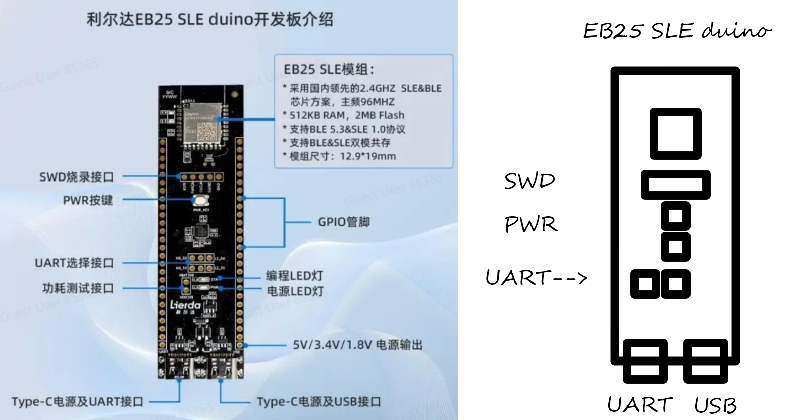

# Nearlink EB25 SIG
---
目前仓库的现状是：
初步维护状态_

项目整体思路：
- 1.造车
- - 上电机 520编码电机

- 2.通讯模块
- - EB25
- 3.供电电源
- - 12V电池盒+稳压模块+5W * 8 的太阳能板

这就是近期的大体分工

### 项目成员分工:
 @和尚 ROS，PWM； @徐逸凡 硬件； @徐欣晨 文档维护
---
<table>
    <tr>
      <td >
      <td >
      <td >
      <td >
    </tr>

   <tr>  
      <td >
      <td >
      <td >
      <td >
   
    </tr>
</table>

# https://lierda.feishu.cn/wiki/VBoPwV3oRiJRjWkb1ZkcgVMynmg
### 以下是大家可以轻松编辑交流的文档区：（提交方法在Readme结尾~~~）

 @和尚 【ROS开发板】https://www.yahboom.com/study/ROS-Driver-Board

#### 介绍

常工院的一个[Nearlink](https://www.hisilicon.com/cn/techtalk/nearlink)兴趣小组，想在openEuler\Rt-Thread上混合编译Nearlink接口，达到有即插即用的Nearlink硬件目的

## 我们的主要利用[这个仓库](https://gitee.com/darrenpig/openeuler-nearlink)的方式：更新readme

#### 项目结构说明
我们能用Gitee做啥子？
共享文件、项目进度

#### 资料共享

##### 1.使用手册：https://lierda.feishu.cn/wiki/VBoPwV3oRiJRjWkb1ZkcgVMynmg

##### 2.网址：https://lierda.feishu.cn/wiki/X360wInOjihWzukypNzc0Df5nHf?utm_source=pocket_saves

#### 项目成员： @DarrenPig 、 @徐逸凡 、 @徐欣晨 ， @和尚 

### 个人进度

####  @DarrenPig 
3.24 建立[仓库](https://gitee.com/darrenpig/openeuler-nearlink)，维护Readme
3.25 队友组织，相关文档的推送。
4.17 我的本地环境https://mp.weixin.qq.com/s/rg3NYJRQcsNliDUJerOzuw这个方式装的
5.22 拉起容器

####  @徐逸凡 @徐欣晨 
3.25 拿板子 
3.24 预组会讨论
4.22 准备硬件
4.28 小车底盘到位，准备上电

---
## 维护记录：
#### 3.24 @DarrenPig 建仓Readme，传文档
## 项目进度：
#### 2.24 图书馆二楼
#### 4.17 @ DarrenPig 更新Readme,跟进进度
#### 4.18 @ DarrenPig 更新Readme,推动项目进度（底盘分工组会）、（步进电机）支架购买
#### 4.20 @ DarrenPig 图书馆二楼，检查电机，调整开发板环境； @ 徐逸凡 底板购买、喷涂购买
#### 4.21 @ 和尚 板子上电成功
#### 4.22 @ 和尚 换板子 国信长天Cortex-M4、@ 徐欣晨 Matlab 公式、竞赛交流
#### 4.28 @ 和尚 12V电池已到、ROS拓展板直接做电机驱动，记得封装好函数  @徐逸凡 @徐欣晨 底盘已到记得即使搞定固定与喷涂 
#### 5.2  @ DarrenPig 今天必须开始 imx 8 的SDK编译烧录了， @徐逸凡  有材料可以先涂
#### 5.4  @ DarrenPig 建模完成
---
###### @所有人 修改Readme方法：
>>> 
