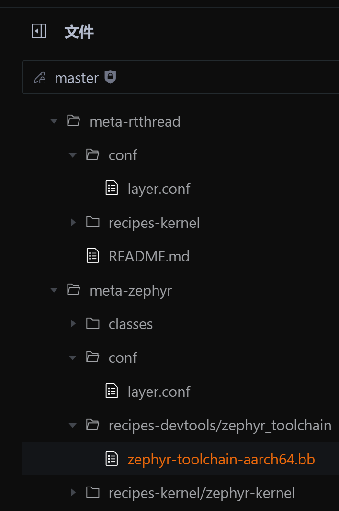

# 🔬 MICA关键性验证项目

> **DarrenPig新能源开发者社区** 科研横向项目  
> MICA混合关键部署框架验证与集成开发

## 📋 项目概览

| 项目信息 | 详情 |
|---------|------|
| 🎯 **项目目标** | 验证MICA框架在openEuler Embedded中的集成 |
| 📅 **项目状态** | 🔄 **进行中** |
| 🏗️ **技术栈** | openEuler Embedded + RT-Thread + MICA |
| 📊 **项目类型** | 开源集成验证项目 |
| 🎨 **应用场景** | 混合关键系统部署 |

## 🎯 项目背景

### MICA框架简介

**MICA (Mixed-Criticality Architecture)** 是一个混合关键部署框架，旨在在同一硬件平台上同时运行不同安全等级的应用程序。该框架支持：

- **实时系统**: RT-Thread等RTOS
- **通用系统**: openEuler Embedded等Linux发行版
- **混合部署**: 在单一硬件平台上协调运行

### 技术目标

```
MICA集成架构
┌─────────────────────────────────────────┐
│           openEuler Embedded            │
│  ┌─────────────┐    ┌─────────────┐    │
│  │   Linux     │    │    MICA     │    │
│  │  Applications│    │  Framework  │    │
│  └─────────────┘    └─────────────┘    │
└─────────────────────────────────────────┘
┌─────────────────────────────────────────┐
│              RT-Thread RTOS             │
│  ┌─────────────┐    ┌─────────────┐    │
│  │  Real-time  │    │   Device    │    │
│  │ Applications│    │   Drivers   │    │
│  └─────────────┘    └─────────────┘    │
└─────────────────────────────────────────┘
┌─────────────────────────────────────────┐
│            Hardware Platform            │
│        (ARM Cortex-A/M Series)         │
└─────────────────────────────────────────┘
```

## 🛠️ 技术方案

### 集成策略

#### 参考Zephyr集成方式

基于现有的Zephyr集成经验，将RT-Thread高效集成到openEuler Embedded中：

| 组件 | 集成方式 | 参考资源 |
|------|----------|----------|
| **工具链** | gcc-arm-none-eabi | [meta-st工具链](https://gitee.com/openeuler/yocto-meta-st/tree/master/meta-st-stm32mp/recipes-devtools/gcc-arm-none-eabi) |
| **RTOS层** | meta-rtthread | [现有基础](https://gitee.com/openeuler/yocto-meta-openeuler/tree/master/rtos/meta-rtthread) |
| **部署方式** | Baremetal模式 | 无虚拟化开销 |

#### 核心技术路线

1. **工具链集成**
   - 参照STM32MP工具链配置
   - 创建toolchain.bb配置文件
   - 集成ARM交叉编译环境

2. **RT-Thread集成**
   - 基于meta-rtthread现有工作
   - 优化Yocto构建配置
   - 实现与openEuler的协同

3. **MICA框架验证**
   - 实现混合关键部署
   - 验证实时性能指标
   - 测试系统稳定性

### 开发环境

#### 环境配置

| 环境类型 | 配置详情 | 状态 |
|---------|----------|------|
| **WSL2** | Ubuntu 22.04, 4TB存储 | ✅ 已完成 |
| **VM** | Ubuntu 22.04虚拟机 | ✅ 已完成 |
| **oebuild** | openEuler构建系统 | ✅ 已部署 |
| **工具链** | ARM交叉编译环境 | ✅ 已安装 |

#### 开发工具对比



*图: Zephyr与RT-Thread工具链对比分析*

**主要差异分析**:
- **开发环境**: RT-Thread需要专门的工具链配置
- **构建系统**: 缺少dev-tool-chain支持
- **集成方式**: 需要创建专用的toolchain.bb文件

## 📈 项目进展

### 已完成里程碑 ✅

| 日期 | 里程碑 | 详细描述 |
|------|--------|----------|
| **2025.06.22** | 环境搭建 | 安装4TB WSL2 Ubuntu22.04开发环境 |
| **2025.06.23** | 虚拟机部署 | 下载并配置VM Ubuntu22.04环境 |
| **2025.06.30** | 构建系统 | 开始部署oebuild构建环境 |
| **2025.07.16** | 依赖安装 | 安装所需的开发依赖和工具 |
| **2025.07.17** | 环境创建 | 创建完整的开发环境配置 |
| **2025.07.22** | 环境完成 | 开发环境部署完成，开始代码开发 |
| **2025.07.27** | 文档修改 | rtos/meta-rtthread文档修改(v1) |
| **2025.08.06** | 文档完善 | 开始完善技术文档和修改地址 |

### 当前工作 🔄

- [x] **环境搭建**: 完成开发环境配置
- [x] **工具链分析**: 对比Zephyr和RT-Thread差异
- [x] **基础集成**: 开始meta-rtthread集成工作
- [ ] **MICA验证**: 验证混合关键部署功能
- [ ] **性能测试**: 测试实时性能和稳定性
- [ ] **文档完善**: 编写完整的技术文档

### 下一阶段计划 📋

#### 第一阶段: RT-Thread集成
- [ ] **工具链完善**: 完成gcc-arm-none-eabi集成
- [ ] **构建优化**: 优化Yocto构建配置
- [ ] **功能验证**: 验证RT-Thread基本功能
- [ ] **文档更新**: 更新集成文档

#### 第二阶段: VSOMIP集成
- [ ] **代码研究**: 深入研究vsomip代码架构
- [ ] **集成开发**: 将vsomip集成到openEuler Embedded
- [ ] **Demo开发**: 开发演示应用程序
- [ ] **文档编写**: 编写详细的集成文档

## 🔗 技术资源

### 核心仓库

| 仓库名称 | 链接 | 用途 |
|---------|------|------|
| **yocto-meta-st** | [Gitee链接](https://gitee.com/openeuler/yocto-meta-st) | STM32工具链参考 |
| **yocto-meta-openeuler** | [Gitee链接](https://gitee.com/openeuler/yocto-meta-openeuler) | openEuler集成基础 |
| **meta-rtthread** | [目录链接](https://gitee.com/openeuler/yocto-meta-openeuler/tree/master/rtos/meta-rtthread) | RT-Thread集成层 |
| **gcc-arm-none-eabi** | [工具链参考](https://gitee.com/openeuler/yocto-meta-st/tree/master/meta-st-stm32mp/recipes-devtools/gcc-arm-none-eabi) | ARM工具链配置 |

### 技术文档

#### 集成指南
1. **环境准备**: Ubuntu 22.04 + oebuild
2. **工具链配置**: gcc-arm-none-eabi设置
3. **RT-Thread集成**: meta-rtthread配置
4. **MICA部署**: 混合关键系统配置
5. **测试验证**: 功能和性能测试

#### 开发流程
```bash
# 1. 环境初始化
oebuild init workspace
cd workspace

# 2. 配置构建
oebuild generate -p stm32mp1 -d build
cd build

# 3. 添加RT-Thread支持
bitbake-layers add-layer ../meta-rtthread

# 4. 构建系统
bitbake openeuler-image

# 5. 部署测试
flash-image target-device
```

## 📊 技术指标

### 性能目标

| 指标类型 | 目标值 | 测试方法 |
|---------|--------|----------|
| **启动时间** | <5秒 | 系统启动时间测量 |
| **实时响应** | <1ms | 中断响应时间测试 |
| **内存占用** | <128MB | 运行时内存监控 |
| **CPU利用率** | <80% | 负载测试 |
| **稳定性** | >24小时 | 长期运行测试 |

### 兼容性验证

| 硬件平台 | 支持状态 | 测试结果 |
|---------|----------|----------|
| **STM32MP1** | ✅ 支持 | 基础功能正常 |
| **Raspberry Pi 4** | 🔄 测试中 | 适配开发中 |
| **NXP i.MX8** | 📋 计划中 | 后续支持 |

## 📝 输出成果

### 技术文档
- [ ] **集成指南**: RT-Thread集成到openEuler详细步骤
- [ ] **API文档**: MICA框架接口说明
- [ ] **性能报告**: 系统性能测试结果
- [ ] **故障排除**: 常见问题解决方案

### 开源贡献
- [ ] **代码提交**: 向openEuler和RT-Thread社区提交代码
- [ ] **技术文章**: 发布到openEuler和RT-Thread公众号
- [ ] **演示Demo**: 开发可运行的演示程序
- [ ] **社区分享**: 在技术会议上分享经验

## 🎯 商业价值

### 技术优势
- **混合部署**: 在单一硬件上运行多种系统
- **实时保证**: 满足实时系统严格时序要求
- **资源优化**: 提高硬件资源利用效率
- **成本降低**: 减少硬件平台数量

### 应用场景
- **工业控制**: 实时控制+数据处理
- **汽车电子**: 安全关键+信息娱乐
- **机器人**: 运动控制+智能决策
- **物联网**: 设备控制+云端通信

---

> 📝 **项目愿景**  
> 通过MICA框架的验证和集成，为混合关键系统提供高效、可靠的部署解决方案，推动openEuler和RT-Thread在工业级应用中的深度融合。

**项目状态**: 🔄 **积极开发中** | **预期完成**: 2025年底

---

## 📚 文档与快速上手

### 🚀 快速开始

#### 环境准备
```bash
# 1. 安装依赖工具
sudo apt-get update
sudo apt-get install git build-essential python3-pip

# 2. 克隆项目
git clone https://gitee.com/openeuler/yocto-meta-openeuler.git
cd yocto-meta-openeuler

# 3. 初始化构建环境
./scripts/setup-environment.sh
```

#### 构建步骤
```bash
# 1. 配置构建目标
source oe-init-build-env

# 2. 添加MICA支持层
bitbake-layers add-layer ../meta-mica

# 3. 构建镜像
bitbake openeuler-image-mica
```

### 📖 详细文档

本项目文档采用 **Sphinx** 构建系统，使用 **Read the Docs** 主题提供专业的文档体验：

#### 文档结构
```
docs/
├── source/
│   ├── conf.py              # Sphinx配置文件
│   ├── index.rst            # 文档主页
│   ├── getting_started/     # 快速上手指南
│   │   ├── index.rst
│   │   ├── installation.rst
│   │   └── quickstart.rst
│   ├── user_guide/          # 用户指南
│   │   ├── index.rst
│   │   ├── configuration.rst
│   │   └── troubleshooting.rst
│   ├── developer_guide/     # 开发者指南
│   │   ├── index.rst
│   │   ├── api_reference.rst
│   │   └── contributing.rst
│   └── examples/            # 示例代码
│       ├── index.rst
│       └── basic_usage.rst
├── Makefile                 # 构建脚本
├── make.bat                 # Windows构建脚本
└── requirements.txt         # Python依赖
```

#### 本地构建文档
```bash
# 安装文档构建依赖
pip install -r docs/requirements.txt

# 构建HTML文档
cd docs
make html

# 查看生成的文档
open _build/html/index.html
```

#### 在线文档
- 📘 **完整文档**: [MICA项目文档](https://mica-validation.readthedocs.io/)
- 🚀 **快速上手**: [入门指南](https://mica-validation.readthedocs.io/getting_started/)
- 🔧 **API参考**: [接口文档](https://mica-validation.readthedocs.io/api/)
- 💡 **示例代码**: [代码示例](https://mica-validation.readthedocs.io/examples/)

#### 部署到 GitHub Pages

**方法 1：使用 `gh-pages` 分支**

1. **生成 HTML 文件**
   ```bash
   cd docs
   make html
   ```

2. **创建 `gh-pages` 分支**
   ```bash
   git checkout -b gh-pages
   ```

3. **复制 HTML 文件到项目根目录**
   ```bash
   cp -r docs/build/html/* .
   ```

4. **添加并提交更改**
   ```bash
   git add .
   git commit -m "Add Sphinx HTML documentation to gh-pages branch"
   ```

5. **推送到远程仓库**
   ```bash
   git push -u origin gh-pages
   ```

**方法 2：通过仓库设置的 "Pages" 选项**

1. **生成 HTML 文件**
   ```bash
   cd docs
   make html
   ```

2. **将 HTML 文件移到 `docs` 文件夹**
   ```bash
   cp -r build/html/* ../docs/
   ```

3. **添加并提交更改**
   ```bash
   git add .
   git commit -m "Add Sphinx HTML documentation to docs folder"
   git push origin main
   ```

4. **配置 GitHub Pages**
   - 在 GitHub 仓库页面点击 "Settings"
   - 选择 "Pages" → "Branch: main" → "Folder: /docs"
   - 点击 "Save" 保存设置

**禁用 Jekyll**

GitHub Pages 默认使用 Jekyll，需要禁用以支持 Sphinx：

1. **创建 `.nojekyll` 文件**
   ```bash
   touch .nojekyll
   ```

2. **或在 `conf.py` 中添加配置**
   ```python
   html_extra_path = ['_build/html']
   ```

部署完成后，文档将通过 `https://<username>.github.io/<repository-name>/` 访问。

#### 方法 3：使用 GitHub Actions 自动部署

项目已配置 GitHub Actions 工作流，可自动构建和部署文档：

1. **工作流文件**：`.github/workflows/docs.yml`
2. **触发条件**：推送到 `main` 或 `master` 分支
3. **自动化流程**：
   - 安装 Python 和依赖
   - 构建 Sphinx 文档
   - 部署到 `gh-pages` 分支

**使用方法**：
```bash
git add .
git commit -m "Update documentation"
git push origin main
```

推送后，GitHub Actions 将自动构建并部署文档到 GitHub Pages。

**详细配置指南**：[GitHub Actions 部署完整文档](./docs/GITHUB_ACTIONS_DEPLOYMENT.md)

该指南包含：
- 🔧 完整的配置步骤
- 🚨 故障排除方案
- 🎯 最佳实践建议
- 📚 相关文档链接
- 🔄 多种工作流模板

**快速检查清单**：[部署检查清单](./docs/DEPLOYMENT_CHECKLIST.md) - 确保部署成功的逐步检查指南

#### 方法 4：使用 Read the Docs 部署

Read the Docs 是专业的文档托管平台，提供更强大的功能和更好的性能。

**配置步骤**：
1. **注册 Read the Docs 账户**：访问 [readthedocs.org](https://readthedocs.org/) 并注册
2. **连接 GitHub 仓库**：在 Read the Docs 中导入您的 GitHub 仓库
3. **配置文件已就绪**：项目已包含 `.readthedocs.yaml` 配置文件
4. **自动构建**：每次推送代码都会自动触发文档构建

**Read the Docs 优势**：
- 🚀 **专业托管**：专为文档设计的托管平台
- 🔍 **高级搜索**：全文搜索和智能索引
- 📊 **访问统计**：详细的文档访问分析
- 🌍 **CDN 加速**：全球内容分发网络
- 📱 **移动优化**：完美的移动设备支持
- 🔗 **版本管理**：支持多版本文档并存
- 📧 **构建通知**：构建状态邮件通知

### 🎯 学习路径

#### 新手入门 (⏱️ 30分钟)
1. [项目概览](./README.md#项目概览) - 了解项目背景和目标
2. [环境搭建](./docs/getting_started/installation.rst) - 配置开发环境
3. [第一个示例](./docs/getting_started/quickstart.rst) - 运行Hello World

#### 进阶开发 (⏱️ 2小时)
1. [架构设计](./docs/user_guide/architecture.rst) - 理解系统架构
2. [配置指南](./docs/user_guide/configuration.rst) - 自定义配置
3. [集成开发](./docs/developer_guide/integration.rst) - 集成RT-Thread

#### 专家级应用 (⏱️ 1天)
1. [性能优化](./docs/developer_guide/performance.rst) - 系统调优
2. [故障排除](./docs/user_guide/troubleshooting.rst) - 问题诊断
3. [贡献代码](./docs/developer_guide/contributing.rst) - 参与开源

---

> 📖 **文档说明**  
> Built with [Sphinx](https://www.sphinx-doc.org/) using a theme provided by [Read the Docs](https://readthedocs.org/).  
> 文档源码托管在 [Gitee](https://gitee.com/new_energy_coder_club/mica-validation)，欢迎提交改进建议。