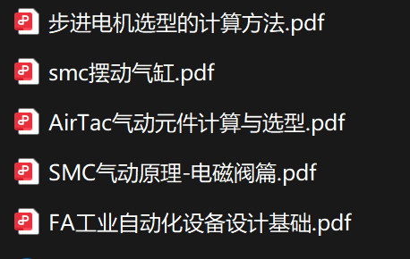

# ⚙️ 气缸控制系统

> **DarrenPig新能源开发者社区** 科研横向项目  
> 高精度气动控制系统设计与实现

## 📋 项目概览

| 项目信息 | 详情 |
|---------|------|
| 🎯 **项目目标** | 开发高精度气动控制系统 |
| 📅 **项目状态** | ✅ **已完成** |
| 👨‍💼 **负责人** | @BINBIN（吴洛斌） |
| 📐 **规格要求** | 2020×200mm |
| 🔢 **需求数量** | 2套 |
| 🎮 **控制方式** | 遥控2.4G/射频 |

## 🏗️ 系统架构

### 气动控制链路

```
气动系统控制流程
┌─────────────┐    ┌─────────────┐    ┌─────────────┐
│   气源供应   │ -> │   压力调节   │ -> │   方向控制   │
│   气泵/气瓶  │    │   减压阀     │    │   电磁阀     │
└─────────────┘    └─────────────┘    └─────────────┘
        │                   │                   │
        v                   v                   v
┌─────────────┐    ┌─────────────┐    ┌─────────────┐
│   执行机构   │ <- │   速度控制   │ <- │   安全保护   │
│   气缸       │    │   节流阀     │    │   泄压阀     │
└─────────────┘    └─────────────┘    └─────────────┘
```

### 详细控制架构

**电磁阀 → 气瓶 → 电磁阀 → 气缸 → 快速泄压阀 → 电磁阀 → 消音器**

| 组件 | 功能 | 技术参数 |
|------|------|----------|
| 🔌 **电磁阀1** | 气源开关控制 | 24V DC，响应时间<50ms |
| 🛢️ **气瓶** | 压缩空气储存 | 工作压力0.4-0.8MPa |
| 🔌 **电磁阀2** | 方向控制 | 5/2通电磁阀，双线圈 |
| ⚙️ **气缸** | 执行机构 | 行程200mm，缸径20mm |
| ⚡ **快速泄压阀** | 快速排气 | 排气时间<100ms |
| 🔌 **电磁阀3** | 排气控制 | 2/2通常闭电磁阀 |
| 🔇 **消音器** | 噪音控制 | 降噪>20dB |

## 🎮 控制系统

### 遥控方案

#### 2.4G无线控制
- **通信协议**: 2.4GHz ISM频段
- **传输距离**: ≥100m（空旷环境）
- **响应延迟**: <20ms
- **抗干扰**: 跳频技术，128个频点
- **电池续航**: >8小时连续使用

#### 射频控制备选
- **工作频率**: 433MHz/315MHz
- **调制方式**: ASK/FSK
- **传输功率**: 10mW
- **接收灵敏度**: -110dBm

### 控制逻辑

```python
# 气缸控制伪代码
class PneumaticController:
    def __init__(self):
        self.valve1 = ElectromagneticValve(pin=1)  # 气源控制
        self.valve2 = ElectromagneticValve(pin=2)  # 方向控制
        self.valve3 = ElectromagneticValve(pin=3)  # 排气控制
        self.pressure_sensor = PressureSensor()
        
    def extend_cylinder(self):
        """气缸伸出"""
        self.valve1.open()      # 打开气源
        time.sleep(0.1)         # 等待压力建立
        self.valve2.set_extend() # 设置伸出方向
        
    def retract_cylinder(self):
        """气缸收回"""
        self.valve2.set_retract() # 设置收回方向
        
    def emergency_stop(self):
        """紧急停止"""
        self.valve1.close()     # 关闭气源
        self.valve3.open()      # 快速泄压
```

## 📊 技术规格

### 气缸参数

| 参数 | 规格 | 说明 |
|------|------|------|
| **缸径** | Φ20mm | 标准ISO气缸 |
| **行程** | 200mm | 可调节行程范围 |
| **工作压力** | 0.1-1.0MPa | 推荐0.4-0.6MPa |
| **理论推力** | 314N@1.0MPa | 最大输出力 |
| **最大速度** | 500mm/s | 无负载状态 |
| **重复精度** | ±0.1mm | 定位精度 |
| **工作温度** | -5°C~60°C | 标准工作环境 |
| **介质** | 压缩空气 | 过滤、干燥 |

### 系统性能指标

| 性能指标 | 数值 | 备注 |
|---------|------|------|
| **响应时间** | <200ms | 从指令到动作完成 |
| **定位精度** | ±0.5mm | 重复定位精度 |
| **工作频率** | 0-10Hz | 连续工作频率 |
| **使用寿命** | >10⁶次 | 标准工况下 |
| **噪音水平** | <65dB | 1米距离测量 |
| **功耗** | <50W | 系统总功耗 |

## 🛠️ 选型清单



*图: 气动元件选型资料*

### 核心元件清单

| 序号 | 元件名称 | 型号规格 | 数量 | 单价(元) | 小计(元) |
|------|----------|----------|------|----------|----------|
| 1 | 双作用气缸 | SC20×200 | 2 | 180 | 360 |
| 2 | 5/2通电磁阀 | 4V210-08 | 2 | 120 | 240 |
| 3 | 2/2通电磁阀 | 2V025-08 | 4 | 80 | 320 |
| 4 | 快速排气阀 | QE-04 | 2 | 25 | 50 |
| 5 | 减压阀 | AR2000-02 | 1 | 150 | 150 |
| 6 | 消音器 | SL-M5 | 4 | 15 | 60 |
| 7 | 气管接头 | PC4-M5 | 20 | 3 | 60 |
| 8 | PU气管 | Φ4×2.5 | 10m | 2 | 20 |
| 9 | 控制器 | Arduino Uno | 1 | 35 | 35 |
| 10 | 2.4G模块 | NRF24L01 | 2 | 15 | 30 |
| **总计** | | | | | **1,325元** |

## 📈 项目进展

### 已完成任务 ✅

- [x] **需求分析**: 明确系统功能和性能要求
- [x] **方案设计**: 完成气动系统架构设计
- [x] **元件选型**: 确定所有气动元件规格
- [x] **控制方案**: 设计2.4G无线控制系统
- [x] **成本核算**: 完成详细的成本分析
- [x] **技术文档**: 编写完整的技术文档

### 后续工作计划 📋

- [ ] **采购执行**: 按清单采购所有元件
- [ ] **系统集成**: 组装完整的气动控制系统
- [ ] **调试测试**: 功能测试和性能验证
- [ ] **优化改进**: 根据测试结果优化系统
- [ ] **交付验收**: 完成2套系统的交付

## 🔧 安装与调试

### 安装步骤

1. **气源准备**: 连接压缩空气源，调节工作压力至0.4-0.6MPa
2. **管路连接**: 按照系统架构图连接所有气动元件
3. **电气连接**: 连接电磁阀控制线路和2.4G通信模块
4. **系统检查**: 检查所有连接的密封性和电气连接
5. **功能测试**: 逐步测试各个功能模块

### 调试要点

- **压力调节**: 根据负载要求调节工作压力
- **速度控制**: 通过节流阀调节气缸运动速度
- **位置校准**: 校准气缸的起始和终止位置
- **通信测试**: 验证2.4G遥控的可靠性和距离

## 📞 技术支持

### 项目负责人
- **姓名**: 吴洛斌 (@BINBIN)
- **专业**: 机械工程/自动化
- **联系方式**: [飞书文档](https://wwd6b1oeu5f.feishu.cn/drive/folder/J5VWftjN1lTzdQd9xEUcnOxGn4u?from=from_copylink)

### 技术文档
- **设计图纸**: 气动系统原理图、装配图
- **操作手册**: 设备操作和维护指南
- **故障排除**: 常见问题及解决方案
- **备件清单**: 易损件和备件信息

---

> 📝 **项目总结**  
> 本项目成功设计并实现了高精度气动控制系统，采用模块化设计理念，具有良好的可扩展性和维护性。系统响应快速、控制精确，满足工业自动化应用需求。

**项目状态**: ✅ **已完成** | **交付时间**: 2025.04.02
