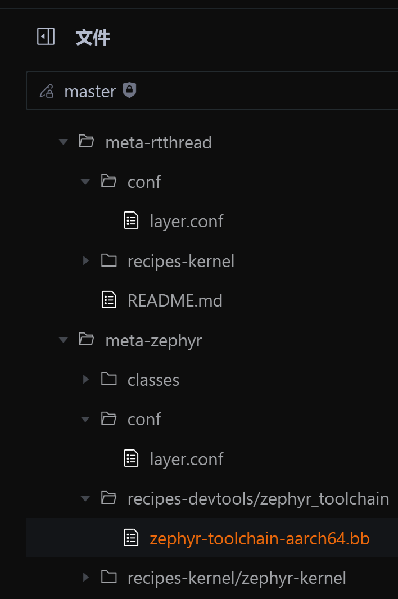

 **DarrenPig：第一个开源项目**

> ## **[openEuler](https://gitee.com/openeuler)/[yocto-meta-st](https://gitee.com/openeuler/yocto-meta-st)**/meta-st-stm32mp/recipes-devtools/**gcc-arm-none-eabi**
>
>  **[openEuler](https://gitee.com/openeuler)/[yocto-meta-openeuler](https://gitee.com/openeuler/yocto-meta-openeuler)**/rtos/meta-rtthread

> 这样第一个热身运动任务：
把参照Zephyr的集成方式，把RT-Thread高效的集成到openEuler Embedded中，要有MICA，可以baremetal的方式（可以不用虚拟化）
https://gitee.com/openeuler/yocto-meta-openeuler/tree/master/rtos/meta-rtthread 之前的工作基础， 对于工具链可以参照
https://gitee.com/openeuler/yocto-meta-st/tree/master/meta-st-stm32mp/recipes-devtools/gcc-arm-none-eabi
集成好之后，刷新一下文档，后面可能还要写个小文章，需要往openEuler和RT-Thread的公众号上推
同步的，开始为第2个任务准备：
* 研究vsomip的代码，
* 集成到openEuler Embedded中的，并准备相应的文档和demo

# 项目进度
#### 250622 安装好4T WSL2 Ubuntu22.04开发环境
#### 250623 下载VM Ubuntu22.04环境
#### 250630 开始部署oebuild
#### 250716 安装需要的环境
#### 250717 创建开发环境
#### 250722 开发环境部署完成

对比了下工具链的差别，实际上主要集中在开发环境，以及在dev-tool-chain的缺失下
应该是需要一个toolchain.bb文件
类似给出的任务也比较详细
https://gitee.com/openeuler/yocto-meta-st/tree/master/meta-st-stm32mp/recipes-devtools/gcc-arm-none-eabi
类似我在clion中集成构建rtt的开发环境，用yocto更为方便

**250727开发环境**

rtos/meta-rtthread 开始文档修改（pull 开始修改版本1）
