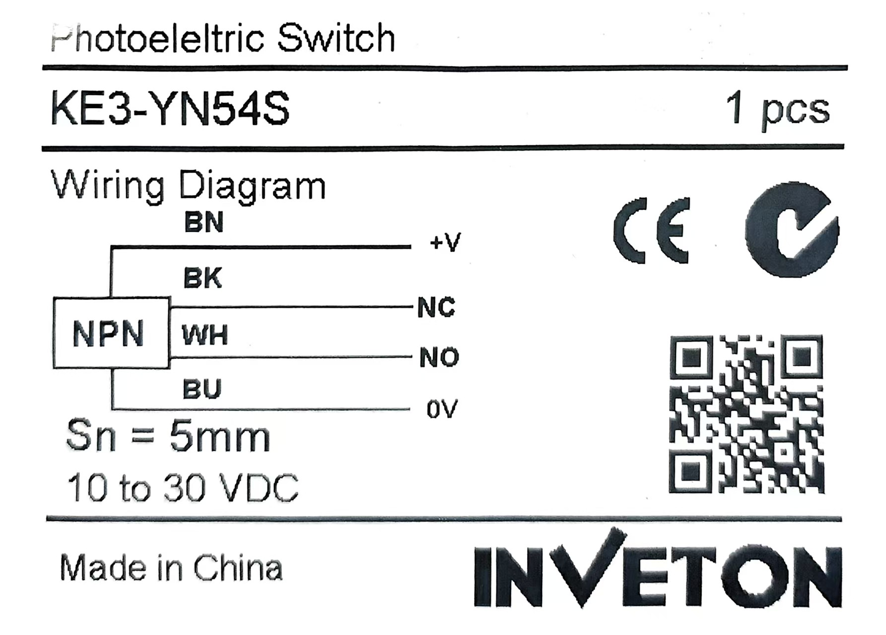
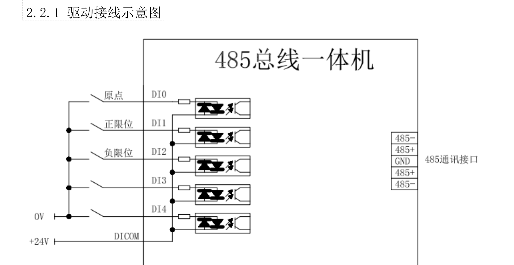
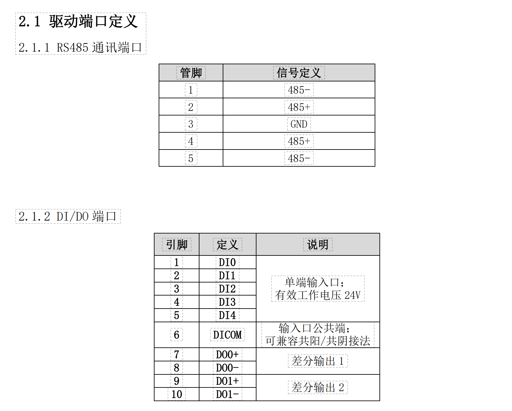
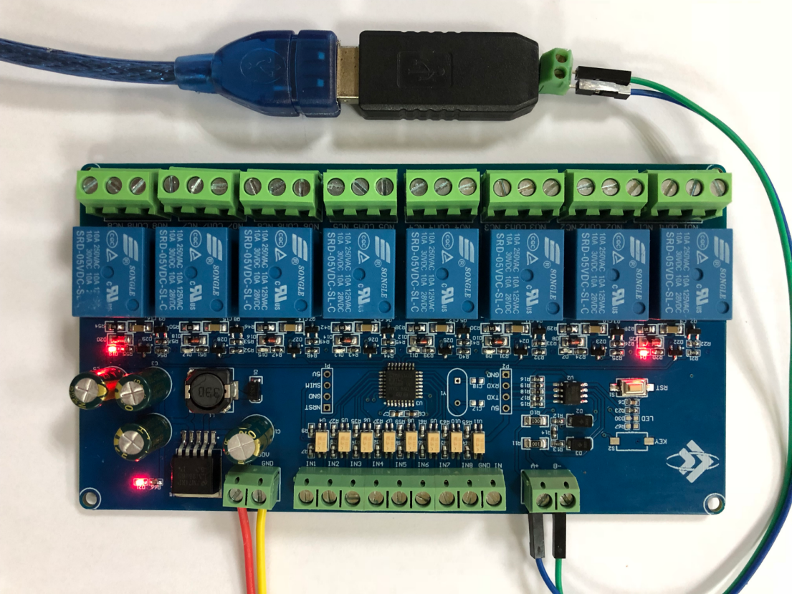

# 流体工作站开发计划
关联issue #IBTPAG

## 流程基线：
@杨鑫海 硬件
@DarrenPig
@单广志
| @杨鑫海    | 硬件 （光电传感器）|
|------------|---------|
| @DarrenPig | 上位机 BSP      | 
| @单广志     | 电控 485       |
| @殷统创     | Qt HMI 界面    |

---
# 个人进度
##  @DarrenPig 
负责元件收发和资料传递
【限位器】73552210370712 中通快递
## @单广志
上位机完成一次SSH调试
## @杨鑫海 
## @殷统创 
负责Qt，界面绘制
---
#  00流体工作站 HMI 开发 Qt 基线

交付时间：8.1
交付方式：硬件整机+全套开发环境代码
项目基线：
### 01.	485控制总线-布线
### 02.	技术架构图-出图
### 03.	源码部署-单点调通
### 04.	硬件给出IP，上位机Qt开调
### 05.	HMI 面板-单点调试
交付方案 Qt 单页联调
> 单页定价，页面出工业设计样稿

> 开发进度：

 @单广志 250326NVDIAA仿真环境搭建进行

 @Leo TianWW 弄清了布线，开始从树莓派角度调试数控

 @Leo TianWW 学习了rs485工业控制例程，开始从modbus协议入手开始能驱动一体式步进电机

# Raspberry Pi 5 Pinout

The RP1 on the RPI5 has 28 multi-functional General-Purpose Input/Output pins available on the Raspberry Pi 40-pin
GPIO connector.

GPIO pins can withstand upto 5V when RP1 is powered, and 3.63V when RP1 is unpowered.

The pins are in a single electrical bank (VDDIO0). The GPIO bank (IO_BANK0) can be powered from 1.8V or 3.3V, but
interface timings have been specified at 3.3V. 

Each pin can be controlled directly by software, or by a number of other functional blocks.

The bank supports the following functions:
 
• 5 × UART
• 6 × SPI
• 4 × I2C
• 2 × I2S - 1× Clock Producer instance, 1× Clock Consumer instance.
• RIO - Registered IO interface
• 24-bit DPI output
• 4-channel PWM output
• AUDIO_OUT - Stereo PWM audio output
• GPCLK - General-purpose clock input and output
• eMMC/SDIO bus with a 4-bit interface
• Interrupt generation from pin level or edge transitions

RP1 is a peripheral controller, designed by Raspberry Pi for use on Raspberry Pi 5. It connects to an application processor (AP),the 16nm Broadcom BCM2712, via a PCIe 2.0 x4 bus, and aggregates many digital controllers and analog PHYs for Raspberry Pi 5’s external interfaces.
---

# 布线原理图

### 光电开关线序

### 485接口图

### 引脚定义

### 限位器

# 维护日志
#### 250429 @DarrenPig  @单广志  @吴洛斌 485理线+热缩管
#### 250430  @卞乐凌  @Leo TianWW 供电布线+限位开关加装
#### 250501  @郑绍恺  @Leo TianWW  @单广志 树莓派5 SSH 开发环境部署
#### 250502  @DarrenPig 光电限位紧固件到货