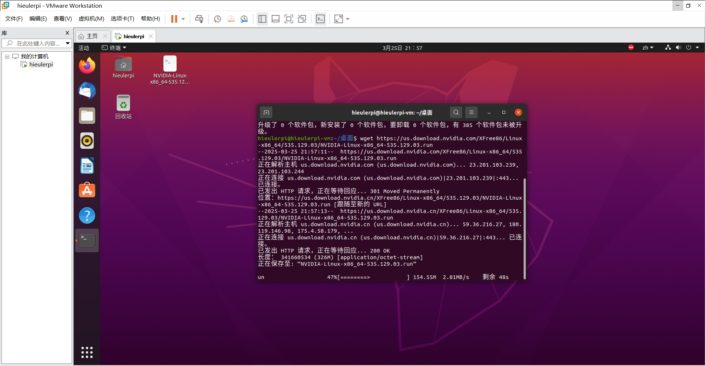

# 流体工作站开发计划
流程基线：
@杨鑫海 硬件
@DarrenPig
@单广志
| @杨鑫海    | 硬件 （光电传感器）|
|------------|---------|
| @DarrenPig | 上位机 BSP      | 
| @单广志     | 电控 485       |
| @殷统创     | Qt HMI 界面    |

#  00流体工作站 HMI 开发 Qt 基线

交付时间：8.1
交付方式：硬件整机+全套开发环境代码
项目基线：
### 01.	485控制总线-布线
### 02.	技术架构图-出图
### 03.	源码部署-单点调通
### 04.	硬件给出IP，上位机Qt开调
### 05.	HMI 面板-单点调试
交付方案 Qt 单页联调
> 单页定价，页面出工业设计样稿

> 开发进度：

 @单广志 250326NVDIAA仿真环境搭建进行

 @Leo TianWW 弄清了布线，开始从树莓派角度调试数控